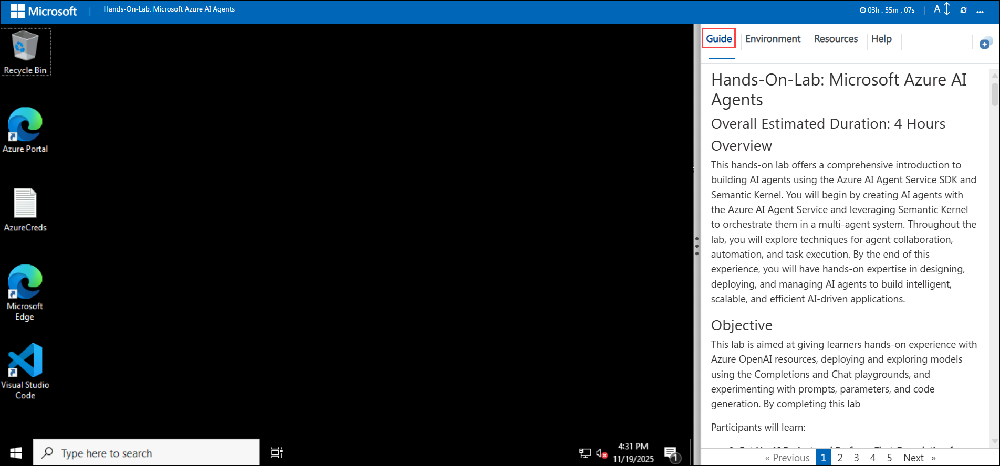
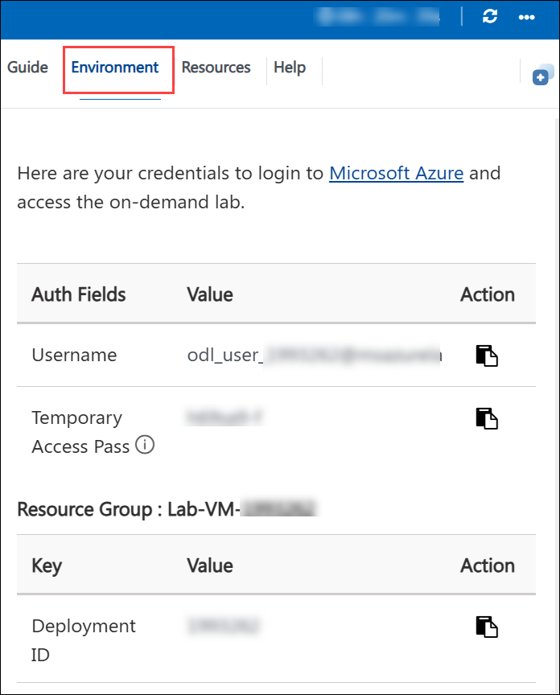
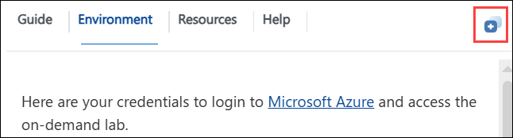
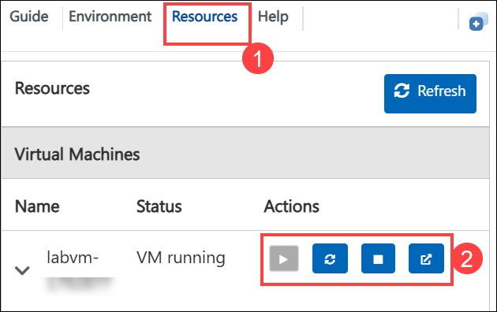
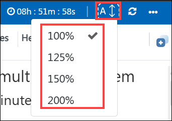
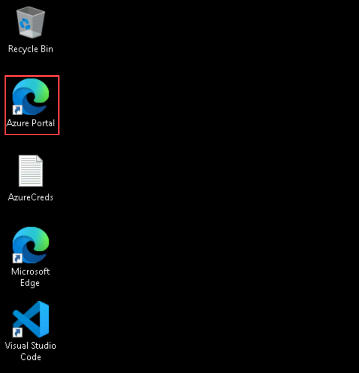
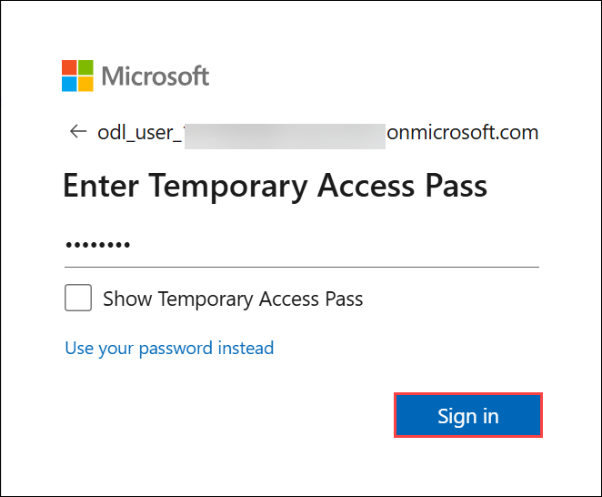

# Hands-On-Lab: Microsoft Azure AI Agents

## Overall Estimated Duration: 4 Hours

## Overview

This hands-on lab offers a comprehensive introduction to building AI agents using the Azure AI Agent Service SDK. You will begin by creating AI agents with the Azure AI Agent Service and orchestrate them in a multi-agent system. Throughout the lab, you will explore techniques for agent collaboration, automation, and task execution. By the end of this experience, you will have hands-on expertise in designing, deploying, and managing AI agents to build intelligent, scalable, and efficient AI-driven applications.

## Objective 

This lab is aimed at giving learners hands-on experience with Azure OpenAI resources, deploying and exploring models using the Completions and Chat playgrounds, and experimenting with prompts, parameters, and code generation. By completing this lab

Participants will learn:

1. **Set Up AI Project and Perform Chat Completion from VS Code:** In this hands-on lab will guide you through setting up the environment for building AI Agents. You will begin by configuring an AI Project in Microsoft Foundry, deploying a Large Language Model (LLM) and embedding models. Next, you will connect Visual Studio Code to the AI Project and perform a chat completion call to validate the setup, ensuring seamless integration and functionality.

2. **Build a Simple AI Agent:** In this hands-on lab, you will be introduced to AI Agents in Azure and learn how to build a simple AI Agent. You will create an agent that generates a bar chart comparing health benefit plans, leveraging AI capabilities to process data and visualise insights effectively.

3. **Build a RAG Agent:** In this hands-on lab, you will build an AI Agent that performs Retrieval Augmented Generation (RAG) on health plan documents. You will leverage Azure AI Search as the vector database to store embeddings, enabling the agent to retrieve relevant information and generate accurate responses based on the document content.

4. **Develop a Multi-Agent System:** In this hands-on exercise, you will build a multi-agent system where four AI Agents collaborate to generate reports on health plan documents. You will create a Search Agent to retrieve policy information from Azure AI Search, a Report Agent to generate detailed reports, a Validation Agent to ensure compliance with specified requirements, and an Orchestrator Agent to manage communication between all agents. This lab will provide practical experience in designing and coordinating AI agents for complex tasks.

## Prerequisites
Participants should have:

1. **Visual Studio Code (VS Code):** Proficiency in using Visual Studio Code for coding, debugging, and managing extensions for various programming languages and frameworks.

1. **Development Skills:** Basic programming knowledge in Python or JavaScript, experience with APIs, SDKs, and working in Visual Studio Code.

1. **Azure AI & Cloud Concepts:** Understanding of Microsoft Foundry, AI Agent development, deploying LLMs and embedding models, and working with Azure AI Search for vector-based retrieval.

1. **AI & Data Processing:** Knowledge of prompt engineering, chat completion workflows, embedding models, retrieval-augmented generation (RAG), and content filtering techniques.

1. **System Design & Multi-Agent Coordination:** Understanding AI agent architectures, designing retrieval, validation, and orchestration agents, and coordinating multi-agent interactions.

## Architecture 

This architecture diagram shows the Standard Agent Setup in Azure, where different resources work together to build and run AI-powered solutions. At the top, Microsoft Foundry acts as the central control point for managing resources, governance, and policies, and serves as the main workspace for developing, testing, and deploying AI agents.
Supporting Foundry are essential Azure services. AI Search enables intelligent search and indexing of large volumes of structured or unstructured data. AI Services provides pre-built AI capabilities like natural language processing, vision, and speech recognition. A Storage Account supplies scalable, reliable, and secure storage for datasets, logs, and model artifacts, making it the backbone of data management in this setup.
Together, these components create a secure, scalable, and modular architecture, enabling enterprises to efficiently build, deploy, and manage AI agents or copilots in Microsoft Foundry.

## Architecture Diagram

 
## Explanation of Components

- **Microsoft Foundry:** A cloud-based platform for developing, deploying, and managing AI models. It allows users to configure AI projects, deploy Large Language Models (LLMs), and integrate embedding models to enhance AI applications.
- **Azure AI Search:** A vector-based search service that enables Retrieval-Augmented Generation (RAG) by indexing and retrieving relevant documents to improve AI-generated responses.
- **Azure AI Services**: A collection of cloud-based AI services that allow developers and data scientists to build intelligent applications, offering pre-built and customizable APIs and models for tasks like speech, vision, language, and knowledge.
- **LLMs and Embeddings:** Understanding Large Language Models (LLMs), their capabilities, and how embeddings are used for text similarity, search, and knowledge retrieval in AI applications.
- **Storage Account:** An Azure Storage Account is a cloud resource that provides scalable, secure, and durable storage for data objects like blobs, files, queues, and tables. It’s used to store structured and unstructured data. You create it in Azure, choose redundancy/replication options, and access data via APIs, SDKs, or portals.

# Getting Started with the lab
 
Welcome to your Azure AI agents workshop! We've prepared a seamless environment for you to explore and learn about Azure services. Let's begin by making the most of this experience:

## Accessing Your Lab Environment
 
Once you're ready to dive in, your virtual machine and **Guide** will be right at your fingertips within your web browser.
 
  

## Virtual Machine & Lab Guide
 
Your virtual machine is your workhorse throughout the workshop. The lab guide is your roadmap to success.
 
## Exploring Your Lab Resources
 
To get a better understanding of your lab resources and credentials, navigate to the **Environment** tab.
 
  
 
## Utilizing the Split Window Feature
 
For convenience, you can open the lab guide in a separate window by selecting the **Split Window** button from the Top right corner.
 
  
 
## Managing Your Virtual Machine
 
Feel free to **Start, Restart, or Stop (2)** your virtual machine as needed from the **Resources (1)** tab. Your experience is in your hands!

   

## Lab Guide Zoom In/Zoom Out
 
To adjust the zoom level for the environment page, click the **A↕: 100%** icon located next to the timer in the lab environment.

  

## Let's Get Started with Azure Portal
 
1. In the LabVM, click on the **Azure portal** shortcut of the Microsoft Edge browser, which is created on the desktop.
 
   

1. You'll see the **Sign into Microsoft Azure** tab. Here, enter your credentials:
 
   - **Email/Username:** <inject key="AzureAdUserEmail"></inject>
 
     
 
1. Next, provide your password:
 
   - **Temporary Access Pass:** <inject key="AzureAdUserPassword"></inject>
 
      

1. If prompted to **Stay Signed in?**, you can click **No**.

   

1. If a **Welcome to Microsoft Azure** pop-up window appears, simply click **Maybe later** to skip the tour.

   

<!--
## Steps to Proceed with MFA Setup if "Ask Later" Option is Not Visible

1. At the **"More information required"** prompt, select **Next**.

1. On the **"Keep your account secure"** page, select **Next** twice.

1. **Note:** If you don’t have the Microsoft Authenticator app installed on your mobile device:

   - Open **Google Play Store** (Android) or **App Store** (iOS).
   - Search for **Microsoft Authenticator** and tap **Install**.
   - Open the **Microsoft Authenticator** app, select **Add account**, then choose **Work or school account**.

1. A **QR code** will be displayed on your computer screen.

1. In the Authenticator app, select **Scan a QR code** and scan the code displayed on your screen.

1. After scanning, click **Next** to proceed.

1. On your phone, enter the number shown on your computer screen in the Authenticator app and select **Next**.
       
1. If prompted to stay signed in, you can click **Yes**.
 
1. If a **Welcome to Microsoft Azure** pop-up window appears, simply click **Cancel** to skip the tour.
-->

## Support Contact
 
The CloudLabs support team is available 24/7, 365 days a year, via email and live chat to ensure seamless assistance at any time. We offer dedicated support channels tailored specifically for both learners and instructors, ensuring that all your needs are promptly and efficiently addressed.
 
Learner Support Contacts:
- Email Support: cloudlabs-support@spektrasystems.com
- Live Chat Support: https://cloudlabs.ai/labs-support

Now, click on **Next** from the lower right corner to move on to the next page.
 
   
 
## Happy Learning!
