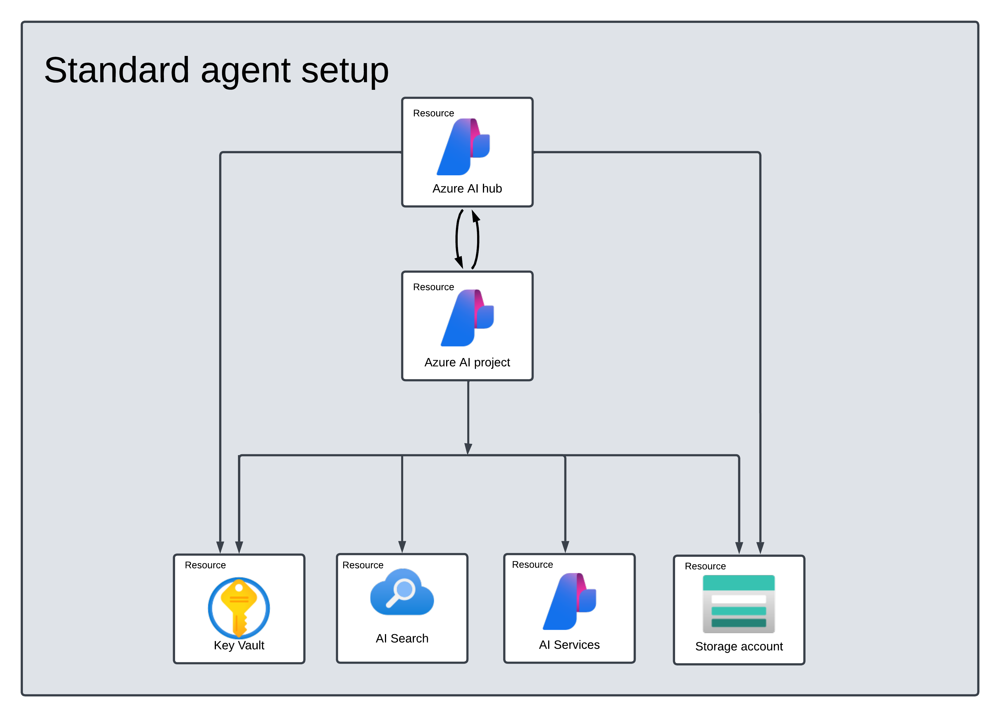
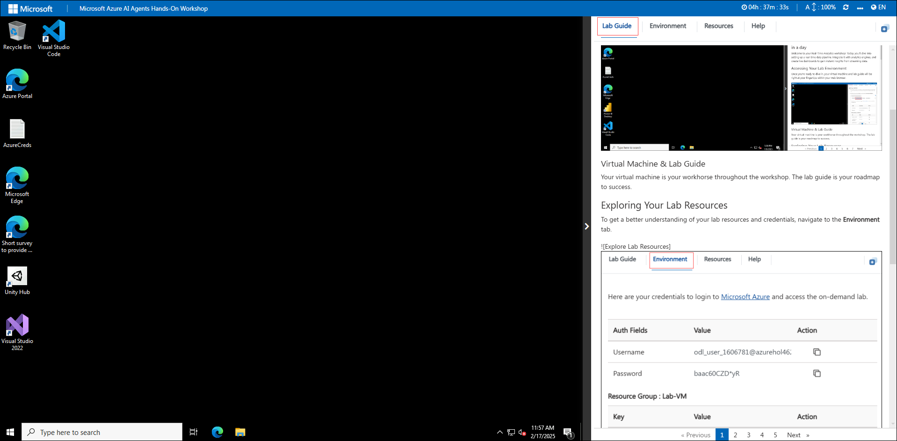
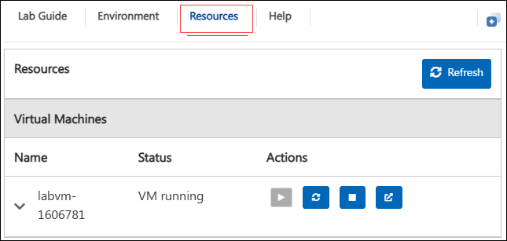

# Getting Started with Your Azure-AI-Agents Workshop
### Overall Estimated Duration: 4 Hours
### Overview

This hands-on lab offers a comprehensive introduction to building AI agents using the Azure AI Agent Service SDK and Semantic Kernel. You will begin by creating AI agents with the Azure AI Agent Service and leveraging Semantic Kernel to orchestrate them in a multi-agent system. Throughout the lab, you will explore techniques for agent collaboration, automation, and task execution. By the end of this experience, you will have hands-on expertise in designing, deploying, and managing AI agents to build intelligent, scalable, and efficient AI-driven applications.

## Objective 

This lab is aimed to give learners hands-on experience with Azure OpenAI resources, deploy and explore models using the Completions and Chat playgrounds, and experiment with prompts, parameters, and code generation. By completing this lab

Participants will learn:

1. **Set Up AI Project and Perform Chat Completion from VS Code:** This hands-on lab will guide you through setting up the environment for building AI Agents. You will begin by configuring an AI Project in Azure AI Foundry, deploying a Large Language Model (LLM) and embedding models. Next, you will connect Visual Studio Code to the AI Project and perform a chat completion call to validate the setup, ensuring seamless integration and functionality.

2. **Build a Simple AI Agent:** In this hands-on lab, you will be introduced to AI Agents in Azure and learn how to build a simple AI Agent. You will create an agent that generates a bar chart comparing health benefit plans, leveraging AI capabilities to process data and visualize insights effectively.

3. **Build a RAG Agent:** In this hands-on lab, you will build an AI Agent that performs Retrieval Augmented Generation (RAG) on health plan documents. You will leverage Azure AI Search as the vector database to store embeddings, enabling the agent to retrieve relevant information and generate accurate responses based on the document content.

4. **Develop a Multi-Agent System:** In this hands-on exercise, you will build a multi-agent system where four AI Agents collaborate to generate reports on health plan documents. You will create a Search Agent to retrieve policy information from Azure AI Search, a Report Agent to generate detailed reports, a Validation Agent to ensure compliance with specified requirements, and an Orchestrator Agent to manage communication between all agents. This lab will provide practical experience in designing and coordinating AI agents for complex tasks.

### Prerequisites
Participants should have:

1. **Development Skills:** Basic programming knowledge in Python or JavaScript, experience with APIs, SDKs, and working in Visual Studio Code.
1. **Azure AI & Cloud Concepts:** Understanding of Azure AI Foundry, AI Agent development, deploying LLMs and embedding models, and working with Azure AI Search for vector-based retrieval.
1. **AI & Data Processing:** Knowledge of prompt engineering, chat completion workflows, embedding models, retrieval-augmented generation (RAG), and content filtering techniques.
1. **System Design & Multi-Agent Coordination:** Understanding AI agent architectures, designing retrieval, validation, and orchestration agents, and coordinating multi-agent interactions.

## Architecture Diagram

 
### Explanation of Components

- **Azure AI Foundry:** A cloud-based platform for developing, deploying, and managing AI models. It allows users to configure AI projects, deploy Large Language Models (LLMs), and integrate embedding models to enhance AI applications.
- **Azure AI Search:** A vector-based search service that enables Retrieval-Augmented Generation (RAG) by indexing and retrieving relevant documents to improve AI-generated responses.
- **LLMs and Embeddings:** Understanding Large Language Models (LLMs), their capabilities, and how embeddings are used for text similarity, search, and knowledge retrieval in AI applications.

# Getting Started with the lab
 
Welcome to your Azure AI agents lab, Let's begin by making the most of this experience:

## Accessing Your Lab Environment
 
Once you're ready to dive in, your virtual machine and lab guide will be right at your fingertips within your web browser.
 
  

### Virtual Machine & Lab Guide
 
Your virtual machine is your workhorse throughout the workshop. The lab guide is your roadmap to success.
 
## Exploring Your Lab Resources
 
To get a better understanding of your lab resources and credentials, navigate to the **Environment** tab.
 
  
 
## Utilizing the Split Window Feature
 
For convenience, you can open the lab guide in a separate window by selecting the **Split Window** button from the Top right corner.
 
  
 
## Managing Your Virtual Machine
 
1. Feel free to start, stop, or restart your virtual machine as needed from the **Resources** tab. Your experience is in your hands!
 
   

## Lab Guide Zoom In/Zoom Out
 
1. To adjust the zoom level for the environment page, click the **A↕ : 100%** icon located next to the timer in the lab environment.

   

<!-- ## Lab Duration Extension

1. To extend the duration of the lab, kindly click the **Hourglass** icon in the top right corner of the lab environment. 

    

    >**Note:** You will get the **Hourglass** icon when 10 minutes are remaining in the lab.

2. Click **OK** to extend your lab duration.
 
   

3. If you have not extended the duration prior to when the lab is about to end, a pop-up will appear, giving you the option to extend. Click **OK** to proceed. -->

## Let's Get Started with Azure Portal
 
1. On your virtual machine, click on the Azure Portal icon.
2. You'll see the **Sign into Microsoft Azure** tab. Here, enter your credentials:
 
   - **Email/Username:** <inject key="AzureAdUserEmail"></inject>
 
     
 
3. Next, provide your password:
 
   - **Password:** <inject key="AzureAdUserPassword"></inject>
 
      

1. If **Action required** pop-up window appears, click on **Ask later**.
1. If a **Welcome to Microsoft Azure** pop-up window appears, simply click **"Cancel"** to skip the tour.

## Support Contact
 
The CloudLabs support team is available 24/7, 365 days a year, via email and live chat to ensure seamless assistance at any time. We offer dedicated support channels tailored specifically for both learners and instructors, ensuring that all your needs are promptly and efficiently addressed.
 
Learner Support Contacts:
 
- Email Support: Cloudlabs-support@spektrasystems.com
- Live Chat Support: https://cloudlabs.ai/labs-support

Click **Next** from the bottom right corner to embark on your Lab journey!
 
   
 
Now you're all set to explore the powerful world of technology. Feel free to reach out if you have any questions along the way. Enjoy your workshop!
