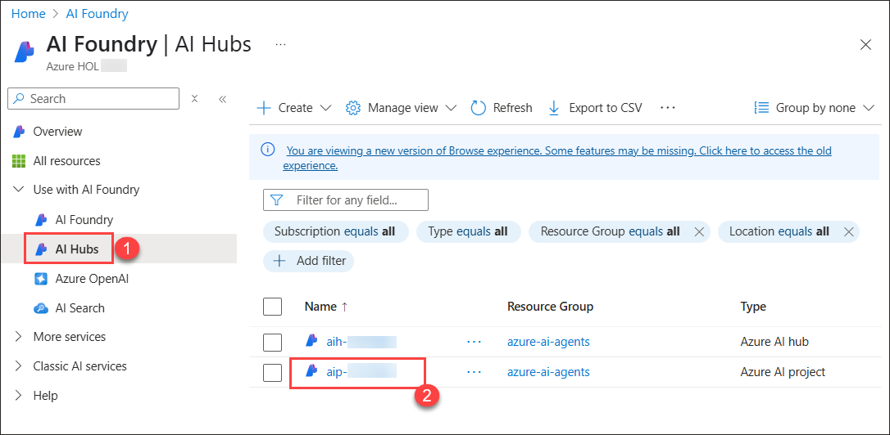
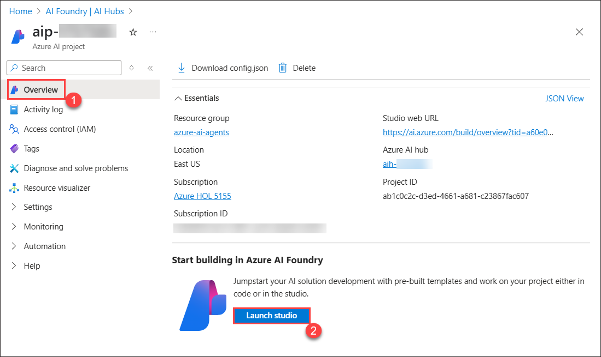
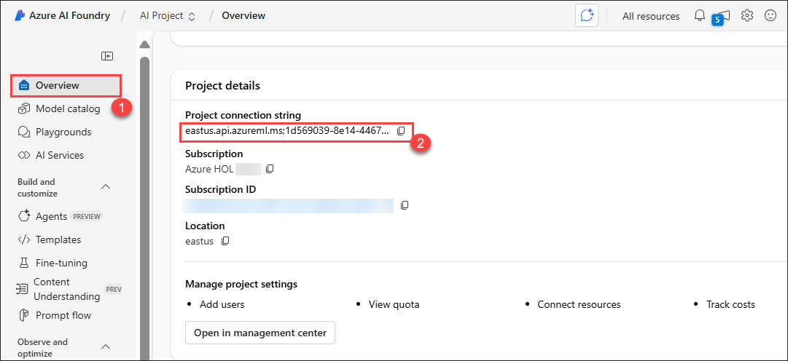
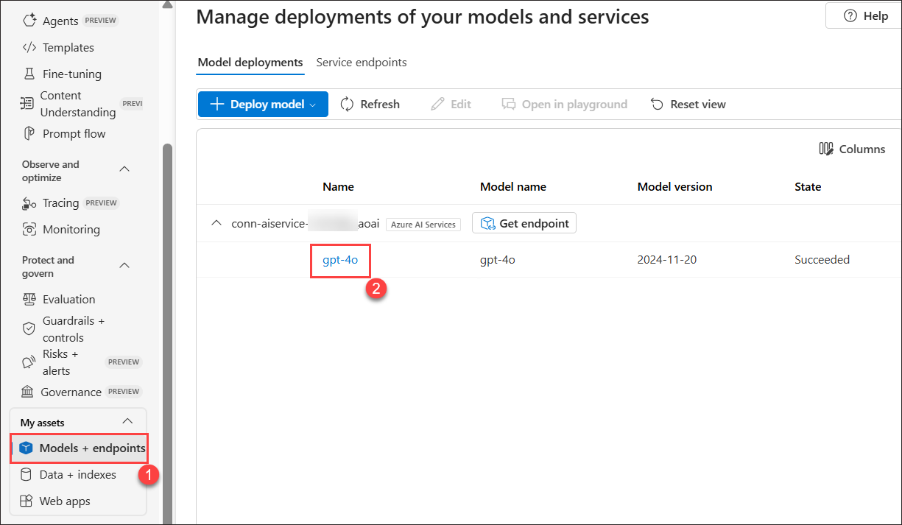
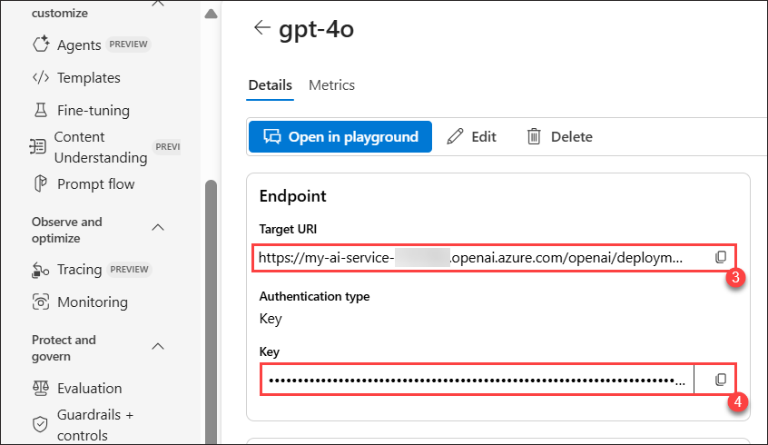
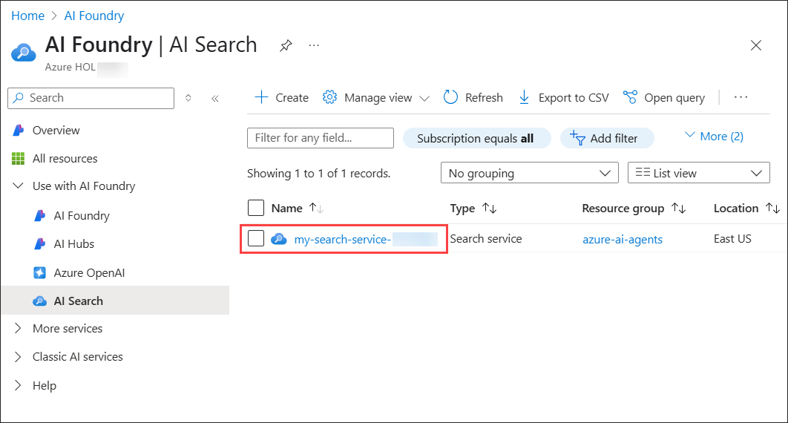

# Lab 1 - Setup AI Project and perform Chat Completion from VS Code
## Estimated duration: 120 minutes
## Lab scenario

In this hands-on lab, you will set up the necessary environment for building AI Agents. You will begin by configuring an AI Project in Azure AI Foundry, followed by deploying a Large Language Model (LLM) and embedding models. Next, you will establish connectivity from Visual Studio Code to the AI Project. Finally, you will perform a simple chat completion call to validate the setup.

## Lab Objectives

In this lab, you will perform:

- Task 1: Accessing Azure AI Foundry Resources
- Task 2: Install dependencies, create a virtual environment, and create an environment variables file.

## Task 1: Accessing Azure AI Foundry Resources

In this task, we will access Azure AI Foundry, retrieve the project connection string, and obtain the GPT-4o model's Target URI and key for integration.

1. On the Azure Portal page, in the Search resources, services, and docs (G+/) box at the top of the portal, enter **Azure AI Foundry (1)**, and then select **Azure AI Foundry (2)** under **Services**.

     

1. In the left navigation pane of AI Foundry, select **AI Hubs (1)**. On the AI Hubs page, click on the Azure AI project named **aip-<inject key="DeploymentID" enableCopy="false" /></inject> (2)**.

     

1. On the **Overview (1)** pane, click on **Launch studio**. This will navigate you to the Azure AI Foundry portal.

    

1. On the **Overview (1)** page of your AI project in the Azure AI Foundry portal, copy the **Project connection string** under **Project Details** and then paste it into Notepad or a secure location, as it will be required for the upcoming tasks.

    
 
1. While in your AI project on the Azure AI Foundry portal, click **Model + Endpoints (1)** under **My Assets** in the left panel to view the deployed **gpt-4o (2)** model. Copy the **Target URI (3)** and **key (4)**, then paste them into Notepad or a secure location, as they will be required for upcoming tasks.

   

   

1. On the Azure Portal page, in the Search resources, services, and docs (G+/) box at the top of the portal, enter **AI Search (1)**, and then select **AI Search (2)** under Services.

   

1. This will navigate you to **AI Foundry | AI Search** page. Select the search service named **my-search-service-<inject key="Deployment ID" enableCopy="false"></inject>**.

   

1. Navigate to **Keys (1)** under Settings and select **Both (2)** for API Access control. 

   

1. Select **Yes** for **API Access control for this search service**.

   

## Task 2: Install dependencies, create a virtual environment, and create an environment variables file

In this task, you will install the required dependencies, set up a virtual environment, and create an environment variables file. This ensures a controlled development environment and securely manages configuration settings for your AI project.

1. On your **Lab VM**, launch **Visual Studio Code**.

1. Click on **File (1)**, then **Open Folder**.

    

1. Navigate to `C:\Labfiles` **(1)**, select the **azure-ai-agents-labs (2)** folder and then click on **Select folder (3)**.

    

1. Click on **Yes, I Trust the authors**,

   

1. Click on the **elipses(...) (1)**, then **Terminal (1)** and then **New Terminal (3)**.

   

1. Make sure you are in the **azure-ai-agents-labs** project directory. Run the below PowerShell commands to create and activate your virtual environment:

   ```powershell
   python -m venv venv
   venv/Scripts/activate
   ```

   

1. Run the below PowerShell command. This installs all the required packages:

   ```powershell
   pip install -r requirements.txt
   ```
   

1. Run the following PowerShell command to  install or upgrade pip to the latest version.

   ```powershell
   python.exe -m pip install --upgrade pip
   ```

   

1. Run the following PowerShell command to install the required package.

   ```
   pip install azure-ai-ml azure-identity
   ```

1. Run the below command to log into your Azure account.

   ```
   az login
   ```

1. Select the <inject key="AzureAdUserEmail"></inject> user account to authorize.

   

1. Once the Authorization is completed, navigate back to the Visual Studio Code.

   

1. Open the **Sample.env** file and provide the necessary environment variables. 

   

    - Retrieve the required values from your **Azure AI Foundry project**.

1. On the **Sample.env** file,

   - `AIPROJECT_CONNECTION_STRING`: Provide the **Project connection string** value you have copied in Step 4.
   - `CHAT_MODEL_ENDPOINT`: Provide the **Target URI** of the **gpt-4o** model you have copied in Step 5.
   - `CHAT_MODEL_API_KEY`: Provide the **Key** value of the **gpt-4o** model you have copied in Step 5.
   - `CHAT_MODEL`: **gpt-4o**

     

1. Save changes to the **Sample.env** file.

1. Run the following PowerShell command. This creates your **.env** file:

   ```powershell
   cp sample.env .env
   ```

      

1. Later, open the **Lab 1 - Project Setup.ipynb** file. The **Lab 1 - Project Setup.ipynb** notebook guides you through setting up an AI Project in Azure AI Foundry, deploying an LLM and embedding models, and configuring VS Code connectivity. It also includes a simple Chat Completion API call to verify the setup. Running this notebook ensures that your environment is correctly configured for developing AI-powered applications. 

   

1. Select the **Select kernel (1)** setting available in the top right corner and select **Install/enable selected extensions (python+jupyter) (2)**.

   

1. Select **Python Environments** to ensure that Jupyter Notebook runs in the correct Python interpreter with the necessary dependencies installed. 

   

1. Select **venv (Python 3.12.1)** from the list as this version is likely required for compatibility with Azure AI Foundry SDK and other dependencies.

   

1. Run the first cell to import the necessary Python libraries for working with Azure AI services.   

   

1. Run the below cell to retrieve the project connection string and model name from environment variables. These values are needed to interact with the Large Language Model (LLM) securely, without hardcoding sensitive information.

   

1. Run the below cell to connect to your Azure AI Foundry project using the connection string. This establishes a secure connection with AIProjectClient, enabling interactions with your project resources.

   

1. Run the below cell to interact with the GPT-4o model using your Azure AI Foundry project. This code initializes a chat client, sends a request for a joke about a teddy bear, and prints the response. Finally, see the output provided from the chat model.

   

## Review

In this lab, you have accomplished the following:
- Set up the AI Project in Azure AI Foundry.
- Deployed an LLM and embedding models.
- Established connectivity from VS Code to the AI Project.
- Performed a simple Chat Completion call.

### You have successfully finished the lab. Click **Next** to continue to the next lab.
