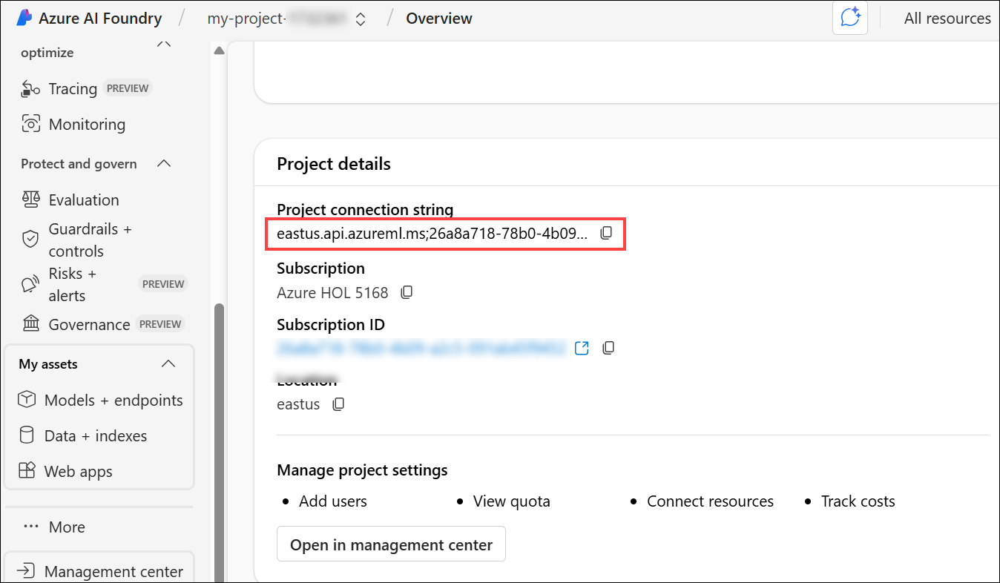
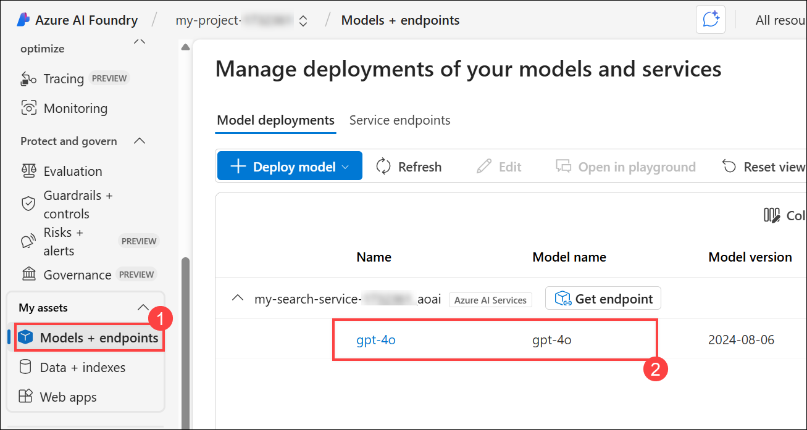
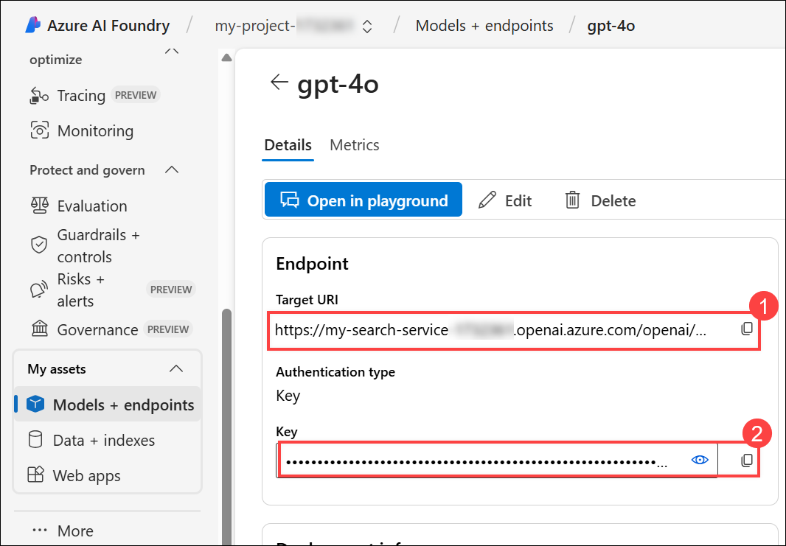
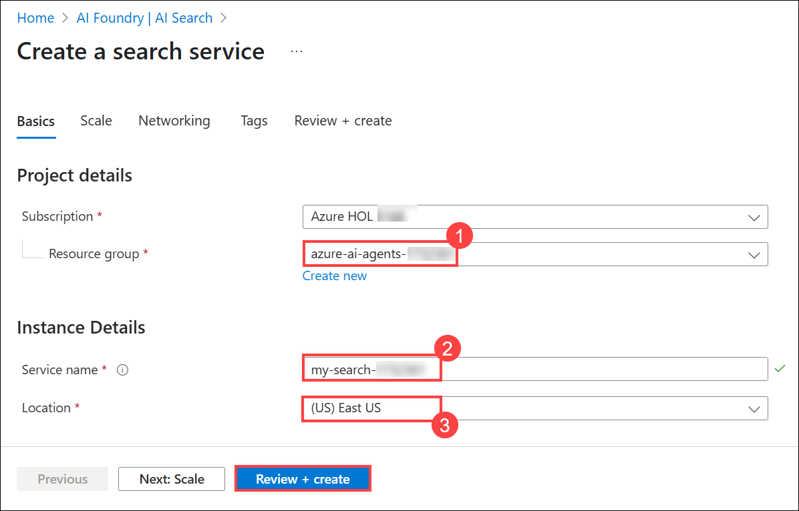

# Lab 1 - Setup AI Project and perform Chat Completion from VS Code
## Estimated duration: 120 minutes
## Lab scenario

In this hands-on lab, you will set up the necessary environment for building AI Agents. You will begin by configuring an AI Project in Azure AI Foundry, followed by deploying a Large Language Model (LLM) and embedding models. Next, you will establish connectivity from Visual Studio Code to the AI Project. Finally, you will perform a simple chat completion call to validate the setup.

## Lab Objectives

In this lab, you will perform:

- Task 1: Setting up the AI Project in the Azure AI Foundry
- Task 2: Deploying an LLM and embedding models
- Task 3: Assign permissions to the Azure AI Search resource
- Task 4: Install dependencies, create a virtual environment, and create an environment variables file.

## Task 1: Setting up the AI Project in the Azure AI Foundry

In this task, you will create and configure an AI Project within Azure AI Foundry. This involves setting up the necessary resources, defining project parameters, and ensuring that the environment is ready for deploying AI models. By the end of this task, you will have a fully initialized AI Project, serving as the foundation for further development and experimentation.

1. On the Azure Portal page, in the Search resources, services, and docs (G+/) box at the top of the portal, enter **AI Foundry (1)**, and then select **Azure AI Foundry (2)** under **Services**.

     

1. In the left navigation pane for the AI Foundry, select **AI Hubs (1)** under **Use with AI Foundry**. On the **AI Hubs** page, click on **+ Create (2)** and select **Hub (3)** from the drop-down.

     

1. On the **Create an AI hub resource** pane, enter the following details:

    - Subscription : **Leave default subscription** 
    - Resource Group : Select **azure-ai-agents-<inject key="Deployment ID" enableCopy="false"></inject> (1)** 
    - Region : **<inject key="Region" enableCopy="false"></inject>** Use the same location as the resource group **(2)**
    - Name : Use the format **aihub-<inject key="Deployment ID" enableCopy="false"></inject> (3)** 

          

    - Connect AI Services incl. OpenAI : Click on **Create new (1)**
    - Create new Azure AI Services: Provide a name to the AI Service, Use the format **my-ai-service-<inject key="Deployment ID" enableCopy="false"></inject> (2)**  
    - Click on **Save (3)**, followed by **Next : Storage (4)**
    
          

1. Click on **Review + create** tab followed by **Create.**

   

    

1. Wait for the deployment to be completed and then click on **Go to resource**

   

1. On the **Overview** pane, click on **Launch Azure AI Foundry**. This will navigate you to the **Azure AI Foundry** portal.

    

1. Scroll down and click on **+ New project** on the **Hub Overview**. 

    

1. Provide the project name as **my-project-<inject key="Deployment ID" enableCopy="false"></inject>** **(1),** then click on **Create (2)**.

    

1. Once the project is created, scroll down and copy the **Project connection string**, then paste it into Notepad or a secure location, as it will be required for upcoming tasks.

    

## Task 2: Deploying an LLM and embedding models

In this task, you will deploy a large language model (LLM) and an embedding model within your Azure AI Foundry project. These models will be used for AI-driven applications and vector-based search capabilities in upcoming labs.

1. In your **AI Foundry project**, navigate to the **My assets** section, then select **Models + endpoints (1)**. Click **Deploy model (2)**, and choose **Deploy base model (3)** to proceed.

   

1. On a **Select a model** window, search for **gpt-4o (1)**, select **gpt-4o (2)** and select **Confirm (3)**

   

1. On **Deploy gpt-4o** window, select **Customize**.

   
SS
   - Change the **Model version to 2024-08-06 (1)**
   - Change the Tokens per Minute Rate Limit to **200K (2)**
   - click on **Connect and deploy (3)**

 stage
        
stage

1. Click on **Model + Endpoints (1)** to view the deployed **gpt-4o (2)** model. Copy the Target URI and key, then paste them into Notepad or a secure location, as they will be required for upcoming tasks.

   

   

1. Navigate back to **Azure Portal** and search for **Open AI (1)** and select **Azure OpenAI (2)** resource.

   

 stage
1. On the **Use with AI Foundry | Azure OpenAI** page, select **+ Create** to create Azure OpenAI resource.

   
 stage

1. On **Create Azure OpenAI** page, provide the following settings and click on **Next (6)**

   | Setting | Value | 
   | --- | --- |
   | Subscription | leave the default subscription **(1)** |
   | Resource group | select the resource group with prefix **azure-ai-agents-<inject key="Deployment ID" enableCopy="false"></inject>** **(2)** |
   | Region | **<inject key="Region" enableCopy="false"></inject>** |
   | Name | **my-openai-service-<inject key="DeploymentID" enableCopy="false" /></inject> (4)** |
   | Pricing tier | **Standard S0 (5)** |

   

1. Click on **Next** thrice.

1. On the **Review + submit** page, click on **Create**
 
   

1. Wait until the deployment succeeds and select **Go to resource**.

stage
   
 stage

1. On the **my-openai-service-<inject key="DeploymentID" enableCopy="false" /></inject>** resource page, select **Go to Azure AI Foundry portal**

   

1. In your **AI Foundry** project, navigate to the **Shared resources** section, then select **Deployments (1)**. Click **Deploy model (2)**, and choose **Deploy base model (3)** to proceed.

   

    >**Note**: The import and vectorize wizard in Azure AI Search, which will be used in subsequent labs, does not yet support text embedding models within your AI Foundry project. Because of this, we need to create an Azure OpenAI service and deploy a text embedding model there. We will use this text embedding model later when we create our vector index.

1. On a **Select a model** window, search for **text-embedding-3-large (1)**, then select **text-embedding-3-large (2)** and select **Confirm (3)**

   

1. On **Deploy model text-embedding-3-large** window, 

   - Deployment type: Select **Standard (1)**
   - Tokens per Minute Rate Limit: **120K (2)**
   - Select **Deploy (3)** to deploy the model.

     

1. Click on **Deployment (1)**, you can see the deployed **text-embedding-3-large (2)** model.

   

## Task 3:  Assign permissions to the Azure AI Search resource

In this task, you will assign the necessary permissions to the Azure AI Search resource to ensure secure access and proper functionality. This includes granting the required roles and access controls for seamless integration with the AI Agent.

1. On the Azure Portal page, in the Search resources, services, and docs (G+/) box at the top of the portal, enter **AI Search (1)**, and then select **AI Search (2)** under **Services**.

   

1. This will navigate you to the **AI Foundry**, within **AI Search**, click on **+ Create**.

   

1. On the **Create a search service** pane enter the following details and click on **Review + create**.

    - Subscription : **Leave default subscription** 
    - Resource Group : Select **azure-ai-agents-<inject key="Deployment ID" enableCopy="false"></inject>** **(1)** 
    - Location : **<inject key="Region" enableCopy="false"></inject>** Use the same location as the resource group **(2)**
    - Service Name : Use the format **my-search-service-<inject key="Deployment ID" enableCopy="false"></inject> (3)**

      

1. On the **Review + create**, click on **Create**.

   

1. Wait until the deployment is completed, and then click on **Go to resource**.

   

1. Navigate to **Identity(1)** under **Settings**. Under System-assigned, set the Status to **On(2)** and click on **Save(3)**. 

   

1. Select **Yes** for **Enable system assigned managed identity**.

   

1. Navigate to **Keys (1)** under Settings and select **Both (2)** for API Access control. 

   

1. Select **Yes** for **API Access control for this search service**.

   

1. Navigate to the **my-openai-service-<inject key="DeploymentID" enableCopy="false" /></inject>** OpenAI service that you created earlier.

   

1. Select **Access control(IAM)(1)**, then click on **+ Add(2)**, and then select **Add role assignment**.

   

1. Under **Job function roles**, search for **Cognitive Services OpenAI User (1)**, select **Cognitive Services OpenAI User (2)**, and then select **Next (3)**.

   

1. On the **Add role assignment** page, 

   - Under Members, select **Managed identity(1)**
   - Click on **+ Select members (1)**
   - Managed identity: **Search service(1)** **(3)**
   - Then, select **my-search-service-<inject key="Deployment ID" enableCopy="false"></inject> (4)** search service.
   - Click on **Select (5)**

     

1. Select **Review + assign** twice.

   

1. On the Azure portal, search for **Storage accounts (1)** and select **Storage accounts (1)** from the services.

   

1. Now, navigate to the **Storage Account** for the project.

   

1. Select **Access control(IAM)(1)**, then click on **+ Add(2)**, and then select **Add role assignment**.

   

1. Under **Job function roles**, search for **Storage Blob Data Reader (1)**, select **Storage Blob Data Reader (2)**, and then select **Next (3)**.

   

1. On the **Add role assignment** page, 

   - Under Members, select **Managed identity(1)**
   - Click on **+ Select members (1)**
   - Managed identity: **Search service(1)** **(3)**
   - Then select **my-search-service-<inject key="Deployment ID" enableCopy="false"></inject> (4)** search service.
   - Click on **Select (5)**

     

1. Select **Review + assign** twice.

      

## Task 4: Install dependencies, create a virtual environment, and create an environment variables file

In this task, you will install the required dependencies, set up a virtual environment, and create an environment variables file. This ensures a controlled development environment and securely manages configuration settings for your AI project.

1. On your **Lab VM**, launch **Visual Studio Code**.

1. Click on **File (1)**, then **Open Folder**.

    

1. Navigate to `C:\LabFiles` **(1)**, select the **azure-ai-agents-labs (2)** folder and then click on **Select Folder (3)**.

    

1. Click on **Yes, I trust the authors**.

   

1. Click on the **elipses(...) (1)**, then **Terminal (1)** and then **New Terminal (3)**.

   

1. Make sure you are in the **azure-ai-agents-labs** project directory. Run the following PowerShell commands to create and activate your virtual environment:

   ```powershell
   python -m venv venv
   venv/Scripts/activate
   ```

   

1. Run the below PowerShell command. This installs all the required packages:

   ```powershell
   pip install -r requirements.txt
   ```
   

1. Run the following PowerShell command to install or upgrade pip to the latest version.

   ```powershell
   python.exe -m pip install --upgrade pip
   ```

   

1. Run the following PowerShell command to install the required package.

   ```
   pip install azure-ai-ml azure-identity
   ```

1. Run the below command to log into your Azure account.

   ```
   az login
   ```

1. Select the **<inject key="AzureAdUserEmail"></inject>** user account to authorize.

   

1. Once the Authorization is completed, navigate back to Visual Studio Code.

   

1. Open the **Sample.env** file and provide the necessary environment variables. 

   

   - Retrieve the required values from your **Azure AI Foundry project**.

1. On the **Sample.env** file,

   - `AIPROJECT_CONNECTION_STRING`: Provide the **Project connection string** value you have copied in Task 1 of step 9
   - `CHAT_MODEL_ENDPOINT`: Provide the **Target URI** of the **gpt-4o** model you have copied in Task 2 of step 4.
   - `CHAT_MODEL_API_KEY`: Provide the **Key** value of the **gpt-4o** model you have copied in Task 2 of step 4.
   - `CHAT_MODEL`: **gpt-4o**

     

1. Save changes to the **Sample.env** file.

1. Run the following PowerShell command. This creates your **.env** file:

   ```powershell
   cp sample.env .env
   ```

      

1. Later, open the **Lab 1 - Project Setup.ipynb** file. The **Lab 1 - Project Setup.ipynb** notebook guides you through setting up an AI Project in Azure AI Foundry, deploying an LLM and embedding models, and configuring VS Code connectivity. It also includes a simple Chat Completion API call to verify the setup. Running this notebook ensures that your environment is correctly configured for developing AI-powered applications. 

   

1. Select the **Select kernel (1)** setting available in the top right corner and select **Install/enable selected extensions (python+Jupyter) (2)**.

   

1. Select **Python Environments** to ensure that Jupyter Notebook runs in the correct Python interpreter with the necessary dependencies installed. 

   

1. Select **venv (Python 3.12.1)** from the list as this version is likely required for compatibility with Azure AI Foundry SDK and other dependencies.

   

1. Run the first cell to import the necessary Python libraries for working with Azure AI services.   

   

1. Run the below cell to retrieve the project connection string and model name from environment variables. These values are needed to interact with the Large Language Model (LLM) securely, without hardcoding sensitive information.

   

1. Run the below cell to connect to your Azure AI Foundry project using the connection string. This establishes a secure connection with AIProjectClient, enabling interactions with your project resources.

   

1. Run the below cell to interact with the GPT-4o model using your Azure AI Foundry project. This code initializes a chat client, sends a request for a joke about a teddy bear, and prints the response. Finally, see the output provided from the chat model.

   

   > **Note**: If in case of any errors related to **unknown connection** please verify the **.env file** and verify the updated values correct them if they are updated incorrectly and save the file. Once right values are corrected, restart the **Jupyter Kernel Session**.

   

## Review

In this lab, you have accomplished the following:
- Set up the AI Project in Azure AI Foundry.
- Deployed an LLM and embedding models.
- Established connectivity from VS Code to the AI Project.
- Performed a simple Chat Completion call.

### You have successfully finished the lab. Click **Next** to continue to the next lab.


