# Lab 1 - Setup AI Project and peform Chat Completion from VS Code

## Lab Overview

In this hands-on lab, you will set up the necessary environment for building AI Agents. You will begin by configuring an AI Project in Azure AI Foundry, followed by deploying a Large Language Model (LLM) and embedding models. Next, you will establish connectivity from Visual Studio Code to the AI Project. Finally, you will perform a simple chat completion call to validate the setup.

## Lab Objectives

In this lab, you will perform:

- Task 1: Setting up the AI Project in the Azure AI Foundry
- Task 2: Deploying an LLM and embedding models
- Task 3: Establish connectivity from VS Code into the AI Project
- Task 4: Perform a simple Chat completion call

## Estimated Duration : 180 minutes

## Task 1: Setting up the AI Project in the Azure AI Foundry

In this task, you will create and configure an AI Project within Azure AI Foundry. This involves setting up the necessary resources, defining project parameters, and ensuring that the environment is ready for deploying AI models. By the end of this task, you will have a fully initialized AI Project, serving as the foundation for further development and experimentation.

1. Open a new tab in the browser and navigate to Azure AI Foundry portal using below link

   ```
    https://ai.azure.com/
   ```
1. Sign in with the below credentials if required.

   - **Email/Username:** <inject key="AzureAdUserEmail"></inject>

   - **Password:** <inject key="AzureAdUserPassword"></inject>

1. After signin to the portal, click on **Create project**

   

1. On a **Create a Project** window, provide `my-ai-project` for **Project name (1)** and select **Customize (2)**

   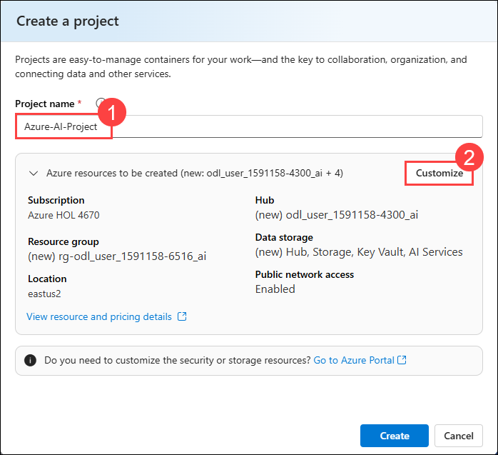

1. Under a **Create a hub (1)**, select **Create new AI Search (2)** to create a AI search service and provide `my-aisearch-service` as the name (3) and click on **Next (4)**. 

   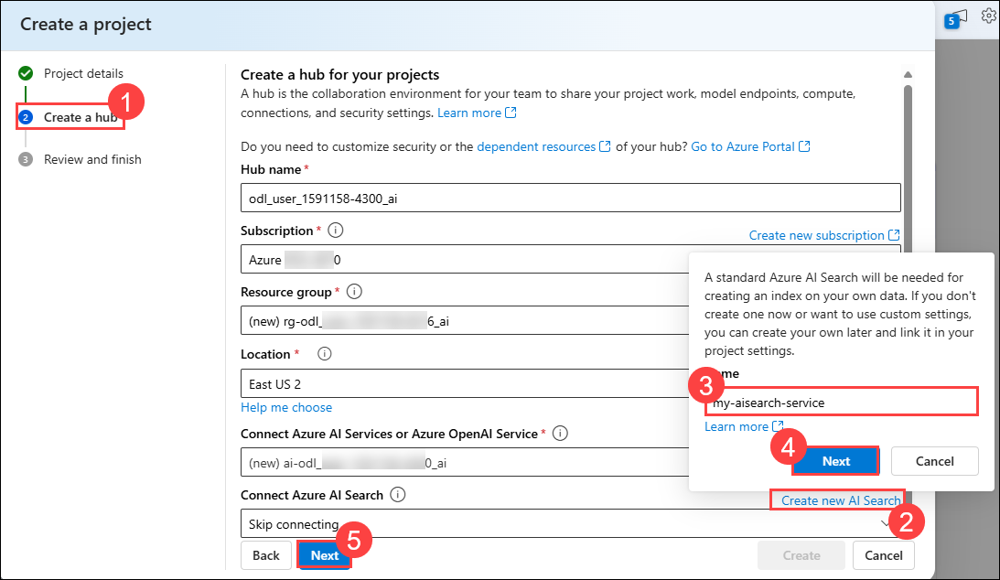

1. Click on **Next (5)**

1. Under **Review and finish (1)**, verify all the details and click on **Create (2)**

   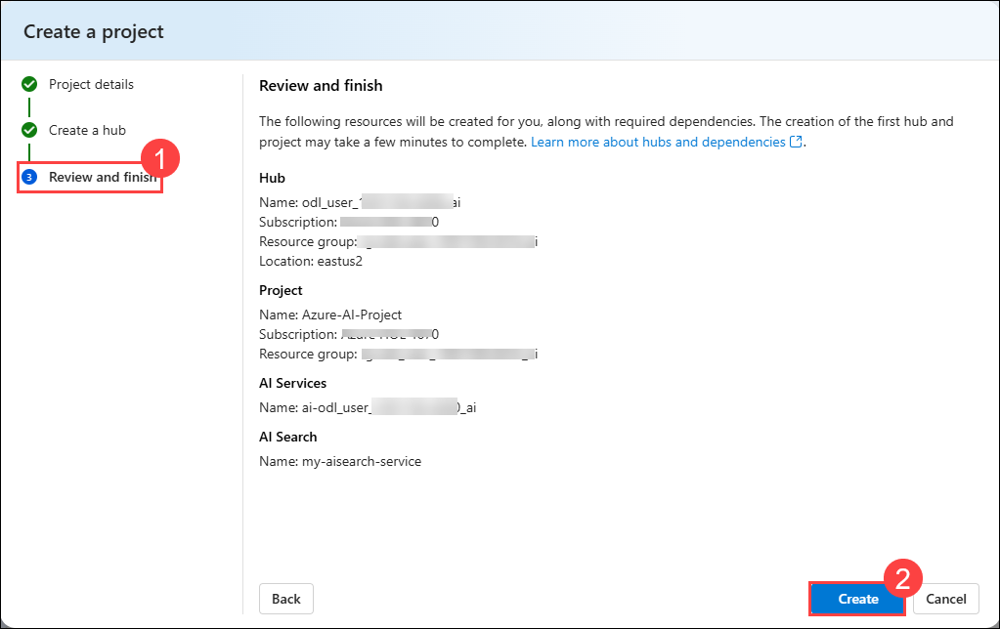

   >**Note**: Wait for few minutes until the necessary resources provisioned.

## Task 2: Deploying an LLM and embedding models

In this task, you will deploy a large language model (LLM) and an embedding model within your Azure AI Foundry project. These models will be used for AI-driven applications and vector-based search capabilities in upcoming labs.

1. In your AI Foundry project, navigate to the **My assets (1)** section, then select **Models + endpoints (2)**. Click **Deploy model (3)**, and choose **Deploy base model (4)** to proceed.

   

1. On a **Select a model** window, select **gpt-4o (1)** and select **Confirm (2)**

   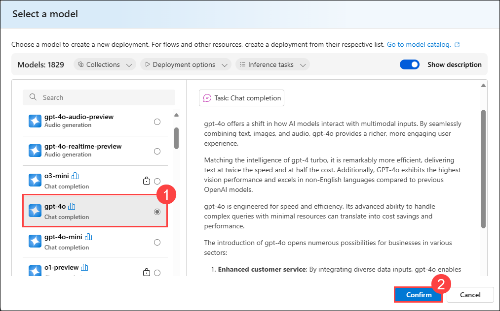

1. On **Deploy model gpt-4o** window, select **Customize**.

   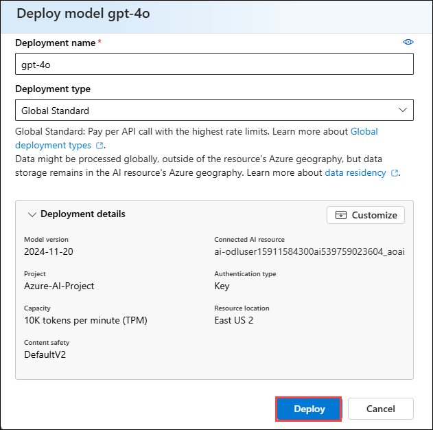

1. Change the Tokens per Minute Rate Limit to **200K** and click on deploy.

1. Navigate to **Azure Portal** and search and select **Azure Open AI** resource

   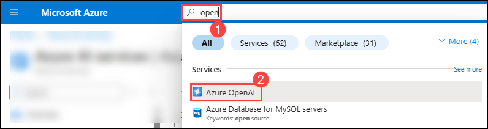

1. On the **Azure AI services | Azure OpenAI** page, select **+ Create** to create azure open ai resource.

   

1. On **Create Azure OpenAI** page, provide the following settings and click on **Next (6)**

   | Setting | Value | 
   | --- | --- |
   | Subscription | Leave the default subscription (1) |
   | Resource group | select the resource group with prefix **rg-odl_user_<inject key="DeploymentID" enableCopy="false" /></inject>** (2) |
   | Region | Leave the default region (3) |
   | Name | my-openai-service<inject key="DeploymentID" enableCopy="false" /></inject> (4) |
   | Pricing tier | Standard S0 (5) |

   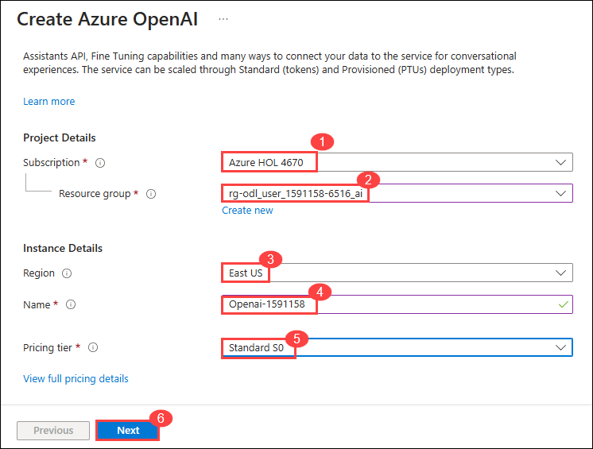

1. Click on **Next** twice and under **Review + submit** page, click on **Create**
 
   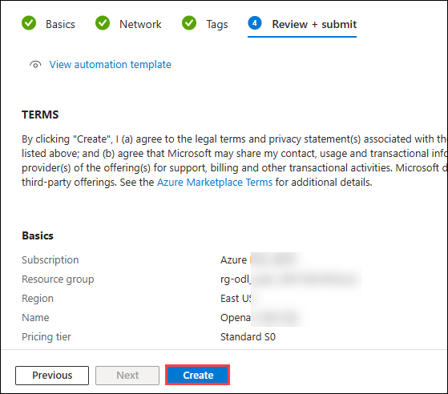

1. Wait until the deployment got succeeded and select **Go to resource**

1. On the **Open ai** resource page, select **Go to Azure AI Foundry portal**

   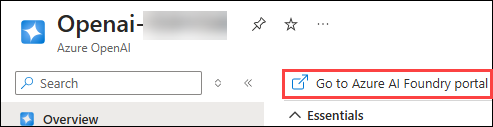

1. In your AI Foundry project, navigate to the **Shared resources** section, then select **Deployments**. Click **Deploy model**, and choose **Deploy base model** to proceed.

   >**Note**: The import and vectorize wizard in Azure AI Search, which will be used in subsequent labs, does not yet support text embedding models within your AI Foundry project. Because of this, we need to create an Azure OpenAI service and deploy a text embedding model there. We will use this text embedding model later when we create our vector index.

1. On a **Select a model** window, select **text-embedding-3-large (1)** and select **Confirm (2)**

   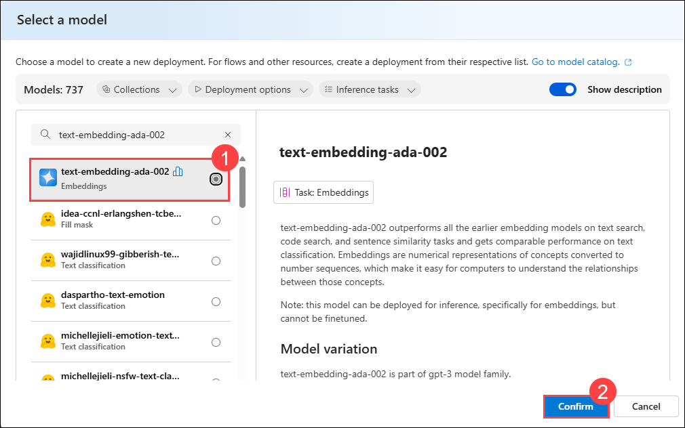

1. On **Deploy model text-embedding-ada-002** window, select **Deploy** to deploy the model

   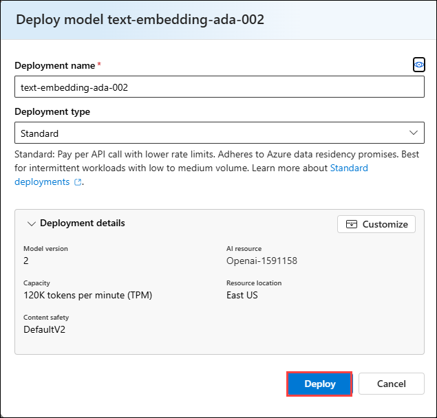

1. On your **Lab VM**, launch **Visual Studio Code** and open the **AZURE-AI-AGENTS-LABS** folder located in *C:\Labfiles*.

1. Open a new terminal and navigate to the AZURE-AI-AGENTS-LABS project directory. Run the below powershell commands to create and activate your virtual environment:

   ```powershell
   python -m venv venv
   venv/Scripts/activate
   ```

   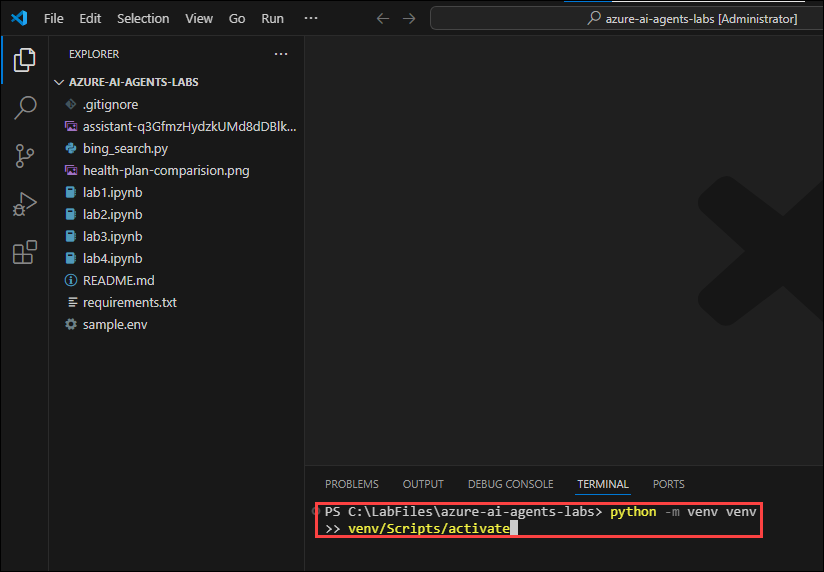

1. Still in the **AZURE-AI-AGENTS-LABS** project directory, run the below powershell command. This installs all the required packages:

   ```powershell
   pip install -r requirements.txt
   ```
   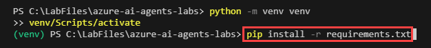

1. Still in the **AZURE-AI-AGENTS-LABS** project directory, run the below powershell command. 

   ```powershell
   python.exe -m pip install --upgrade pip
   ```

1. Still in the **AZURE-AI-AGENTS-LABS** project directory, run the below powershell command. 

   ```powershell
   pip install azure-ai-inference
   ```
1. Still in the **AZURE-AI-AGENTS-LABS** project directory, run the below command and select the user account to authorize.

   ```
   az login
   ```
1. Open the **Sample.env** file and provide the necessary environment variables. Retrieve the required values from your **Azure AI Foundry project** and **Azure OpenAI service**

   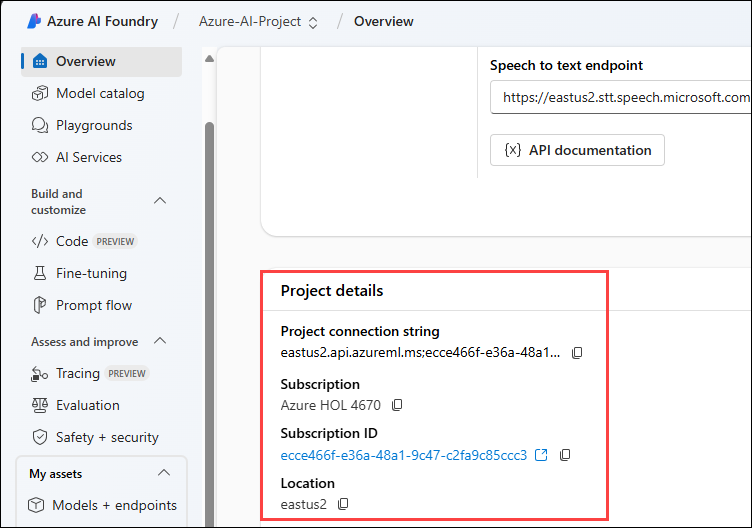

   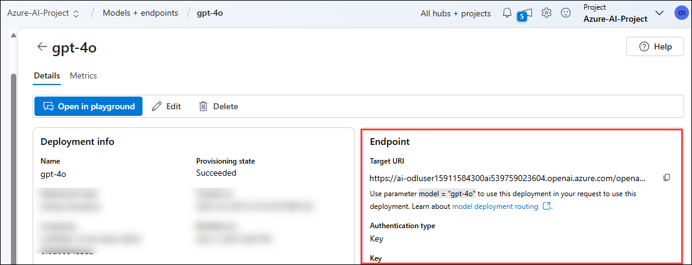

   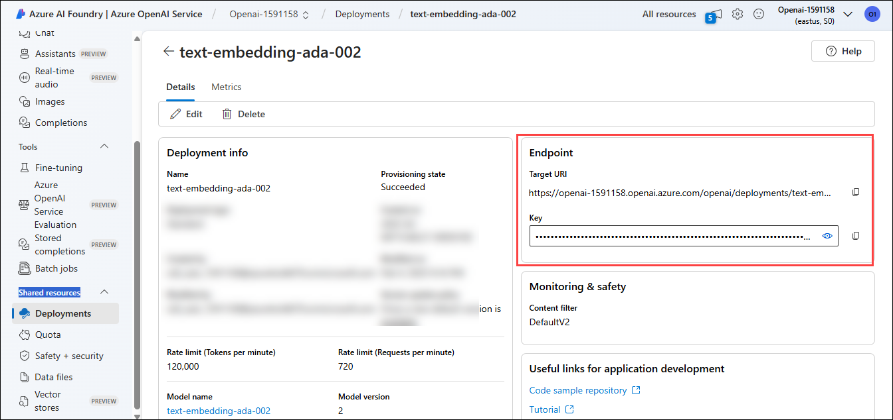

   > **Note:**  
   > - To get the **AIPROJECT_CONNECTION_STRING**, navigate to **Hub project > Overview > Azure AI Services > Project connection string**.  
   > - For the **chat model**, refer to the **GPT-4o model** under your **Hub project** in Azure AI Foundry.  
   > - For the **embedding model**, use the **text-embedding model** created under your **Azure OpenAI resource**.

1. Save changes to the **Sample.env** file.

1. Still in the **AZURE-AI-AGENTS-LABS** project directory, run the below powershell command. This creates your **.env** file:

   ```powershell
   cp sample.env .env
   ```

1. Later Open the **lab1.ipynb** file, select the **Select kernel (1)** setting available in the top right corner and select **Install/enable selected extensions (python+jupyter) (2)**

   

1. select **Python Environments**

   

1. Select **venv (Python 3.12.1)** from the list

   

1. Run the each cell and observe the output and finally see the output provided from the chat model.

   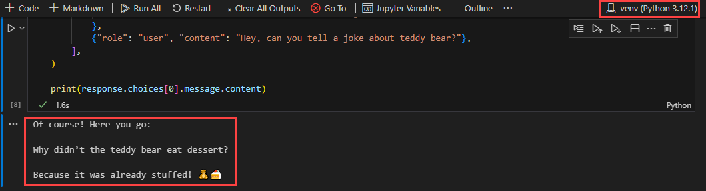


