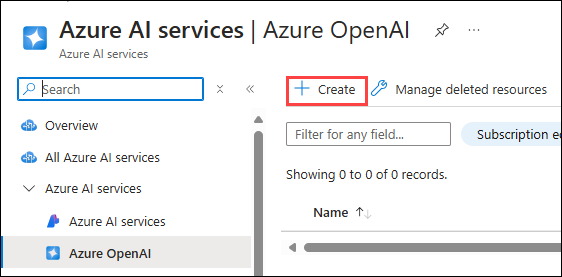

# Lab 1 - Setup AI Project and perform Chat Completion from VS Code
## Estimated duration : 120 minutes
## Lab scenario

In this hands-on lab, you will set up the necessary environment for building AI Agents. You will begin by configuring an AI Project in Azure AI Foundry, followed by deploying a Large Language Model (LLM) and embedding models. Next, you will establish connectivity from Visual Studio Code to the AI Project. Finally, you will perform a simple chat completion call to validate the setup.

## Lab Objectives

In this lab, you will perform:

- Task 1: Setting up the AI Project in the Azure AI Foundry
- Task 2: Deploying an LLM and embedding models
- Task 3: Establish connectivity from VS Code into the AI Project
- Task 4: Perform a simple Chat completion call

## Task 1: Setting up the AI Project in the Azure AI Foundry

In this task, you will create and configure an AI Project within Azure AI Foundry. This involves setting up the necessary resources, defining project parameters, and ensuring that the environment is ready for deploying AI models. By the end of this task, you will have a fully initialized AI Project, serving as the foundation for further development and experimentation.

1. Open a new tab in the browser and navigate to Azure AI Foundry portal using below link

   ```
    https://ai.azure.com/
   ```

1. Click on **Sign in**.

   

1. Sign in with the below credentials, if prompted.

   - **Email/Username:** <inject key="AzureAdUserEmail"></inject>

   - **Password:** <inject key="AzureAdUserPassword"></inject>

1. After sign in to the portal, click on **Create project**

   

1. On a **Create a Project** window, provide `my-ai-project` for **Project name (1)** and select **Customize (2)**

   

1. Under a **Create a hub**, Select **East US (1)** under **Location** and leave everthing to deafult. Select **Create new AI Search (2)** to create a AI search service and provide `my-aisearch-service` as the name **(3)** and click on **Next (4)**, followed by **Next (5)**. 

   

1. On the **Review and finish** page, verify all the details and click on **Create**

   

1. Wait for few minutes until the necessary resources provisioned.    

    

    >**Note**: Click on **Close**, if you recieve any pop up.

## Task 2: Deploying an LLM and embedding models

In this task, you will deploy a large language model (LLM) and an embedding model within your Azure AI Foundry project. These models will be used for AI-driven applications and vector-based search capabilities in upcoming labs.

1. In your **AI Foundry project**, navigate to the **My assets (1)** section, then select **Models + endpoints (2)**. Click **Deploy model (3)**, and choose **Deploy base model (4)** to proceed.

   

1. On a **Select a model** window, search for **gpt-4o (1)**, select **gpt-4o (2)** and select **Confirm (3)**

   

1. On **Deploy model gpt-4o** window, select **Customize**.

   

   - Change the **Model version to 2024-08-06 (1)**
   - Change the Tokens per Minute Rate Limit to **200K (2)**
   - click on **deploy (3)**

        

1. Click on **Model + Endpoints (1)**, there you can see the deployed **gpt-4o (2)** model.

   

1. Navigate back to **Azure Portal** and search for **Open AI (1)** and select **Azure Open AI (2)** resource.

   

1. On the **Azure AI services | Azure OpenAI** page, select **+ Create** to create Azure OpenAI resource.

   

1. On **Create Azure OpenAI** page, provide the following settings and click on **Next (6)**

   | Setting | Value | 
   | --- | --- |
   | Subscription | leave the default subscription **(1)** |
   | Resource group | select the resource group with prefix **rg-odl_user_<inject key="DeploymentID" enableCopy="false" /></inject> -****_ai** **(2)** |
   | Region | **East US (3)** |
   | Name | **my-openai-service<inject key="DeploymentID" enableCopy="false" /></inject> (4)** |
   | Pricing tier | **Standard S0 (5)** |

   

1. Click on **Next** twice.

1. On the **Review + submit** page, click on **Create**
 
   

1. Wait until the deployment got succeeded and select **Go to resource**.

   

1. Seach for **my-openai-service<inject key="DeploymentID" enableCopy="false" /></inject> (1)** and then select **my-openai-service<inject key="DeploymentID" enableCopy="false" /></inject> (2)**.

   

1. On the **my-openai-service<inject key="DeploymentID" enableCopy="false" /></inject>** resource page, select **Go to Azure AI Foundry portal**

   

1. In your AI Foundry project, navigate to the **Shared resources** section, then select **Deployments (1)**. Click **Deploy model (2)**, and choose **Deploy base model (3)** to proceed.

   

    >**Note**: The import and vectorize wizard in Azure AI Search, which will be used in subsequent labs, does not yet support text embedding models within your AI Foundry project. Because of this, we need to create an Azure OpenAI service and deploy a text embedding model there. We will use this text embedding model later when we create our vector index.

1. On a **Select a model** window, search for **text-embedding-3-large (1)**, then select **text-embedding-3-large (2)** and select **Confirm (3)**

   

1. On **Deploy model text-embedding-3-large** window, 

   - Deployment type: Select **Standard (1)**
   - Tokens per Minutes Rate Limit: **120K (2)**
   - Select **Deploy (3)** to deploy the model.

     

1. Click on **Deployment (1)**, you can see the deployed **text-embedding-3-large (2)** model.

   

## Task 3:  Assign permissions to the Azure AI Search resource

In this task, you will assign the necessary permissions to the Azure AI Search resource to ensure secure access and proper functionality. This includes granting the required roles and access controls for seamless integration with the AI Agent.

1. Navigate to **Azure portal**, search for **AI Search (1)** and select **AI Search (2)** resource from the services.

   

1. Select **my-aisearch-servicexxxxxx**.

   

    >**Note**: `xxxxxx` denotes some randome numbers, it varies.

1. Navigate to **Keys (1)** under **Settings** in the left menu. Under **API Access control** select **Both(2)**.

   

1. Select **Yes** for **Are you sure want to update the API Access Control for this serach service**. 

   

1. Navigate to **Identity(1)** under **Settings**. Under System-assigned set the Status to **On(2)** and click on **Save(3)**. 

   

1. Select **Yes** for **Enable System assigned managed identity**.

   

1. Go to the **Azure OpenAI**, **my-openai-service<inject key="DeploymentID" enableCopy="false" /></inject>**.

   

1. Select **Access control(IAM)(1)**, then click on **Add(2)**, and then select **Add role assignment**.

   

1. Under **Job function roles**, search for **Cognitive Services OpenAI User (1)**, select **Cognitive Services OpenAI User (2)**, and then select **Next (3)**.

   

1. On the **Add role assignment** page, 

   - Under Members, select **Managed identity(1)**
   - Select **Members (1)**
   - Managed identity: **search services(1)** **(3)**
   - Then select **my-search-servicexxxx (4)** search service.
   - Click on **Select (5)**

     

1. Select **Review + assign** twice.

   

1. On the Azure portal, serach for **Storage accounts (1)** and select **Storage accounts (1)** from the services.

   

1. Now navigate to the **Storage Account** for the project.

   

1. Select **Access control(IAM)(1)**, then click on **Add(2)**, and then select **Add role assignment**.

   

1. Under **Job function roles**, search for **Storage Blob Data Reader (1)**, select **Storage Blob Data Reader (2)**, and then select **Next (3)**.

   

1. On the **Add role assignment** page, 

   - Under Members, select **Managed identity(1)**
   - Select **Members (1)**
   - Managed identity: **search services(1)** **(3)**
   - Then select **my-search-servicexxxx (4)** search service.
   - Click on **Select (5)**

     

1. Select **Review + assign** twice.

      

## Task 4: Install dependencies, create a virtual environment, and create an environment variables file

In this task, you will install the required dependencies, set up a virtual environment, and create an environment variables file. This ensures a controlled development environment and securely manages configuration settings for your AI project.

1. On your **Lab VM**, launch **Visual Studio Code**.

1. Click on **File (1)**, then **Open Folder**.

    

1. Navigate to `C:\Labfiles` **(1)**, select the **azure-ai-agents-labs (2)** folder and then click on **Select folder (3)**.

    

1. Click on **Yes, I Trust the authors**,

   

1. Click on the **elipses(...) (1)**, then **Terminal (1)** and then **New Terminal (3)**.

   

1. Make sure your in **azure-ai-agents-labs** project directory. Run the below powershell commands to create and activate your virtual environment:

   ```powershell
   python -m venv venv
   venv/Scripts/activate
   ```

   

1. Run the below powershell command. This installs all the required packages:

   ```powershell
   pip install -r requirements.txt
   ```
   

1. Run the below powershell command to  install or upgrade pip to the latest version.

   ```powershell
   python.exe -m pip install --upgrade pip
   ```

   

1. Run the below command to log into your Azure account.

   ```
   az login
   ```

1. Select the <inject key="AzureAdUserEmail"></inject> user account to authorize.

   

1. Once the Authorization is completed, navigate back to the Visual studio code.

   

1. Open the **Sample.env** file and provide the necessary environment variables. 

   

   - Retrieve the required values from your **Azure AI Foundry project**.
   - Navigate to your **Overview (1)** page of `my-ai-project` and then copy and paste the **Project connection string (2)** in a notepad

     

   - Navigate to **gpt-4o** model, copy the under **Endpoint** from right pane, copy and paste the **Target URI (1)** and **Key (2)** in a notepad

     

1. On the **Sample.env** file,

   - `AIPROJECT_CONNECTION_STRING`: Provide **Project connection string** value you have copied in the previous step
   - `CHAT_MODEL_ENDPOINT`: Provide the **Target URI** of **gpt-4o** model you have copied in the previous step
   - `CHAT_MODEL_API_KEY`: Provide the **Key** value of **gpt-4o** model you have copied in the previous step
   - `CHAT_MODEL`: **gpt-4o**

     

1. Save changes to the **Sample.env** file.

1. Run the below powershell command. This creates your **.env** file:

   ```powershell
   cp sample.env .env
   ```

      

1. Later Open the **Lab 1 - Project Setup.ipynb** file. The **Lab 1 - Project Setup.ipynb** notebook guides you through setting up an AI Project in Azure AI Foundry, deploying an LLM and embedding models, and configuring VS Code connectivity. It also includes a simple Chat Completion API call to verify the setup. Running this notebook ensures that your environment is correctly configured for developing AI-powered applications. 

   

1. Select the **Select kernel (1)** setting available in the top right corner and select **Install/enable selected extensions (python+jupyter) (2)**.

   

1. Select **Python Environments** to ensure that Jupyter Notebook runs in the correct Python interpreter with the necessary dependencies installed. 

   

1. Select **venv (Python 3.12.1)** from the list as this version is likely required for compatibility with Azure AI Foundry SDK and other dependencies.

   

1. Run the first cell to import necessary Python libraries for working with Azure AI services.   

   

1. Run the below cell to retrieve the project connection string and model name from environment variables. These values are needed to interact with the Large Language Model (LLM) securely, without hardcoding sensitive information.

   

1. Run the below cell to connect to your Azure AI Foundry project using the connection string. This establishes a secure connection with AIProjectClient, enabling interactions with your project resources.

   

1. Run the below cell to interact with the GPT-4o model using your Azure AI Foundry project. This code initializes a chat client, sends a request for a joke about a teddy bear, and prints the response. Finally see the output provided from the chat model.

   

## Review

In this lab, you have accomplished the following:
- Set up the AI Project in Azure AI Foundry.
- Deployed an LLM and embedding models.
- Established connectivity from VS Code to the AI Project.
- Performed a simple Chat Completion call.

### You have successfully finished the lab. Click **Next** to continue to the next lab.


