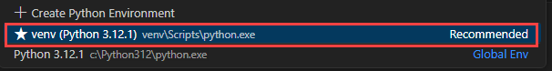
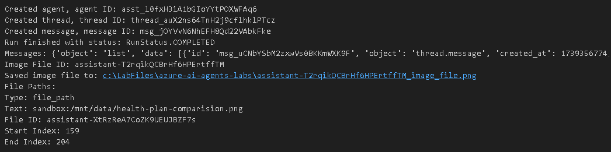

# Lab 2 - Build a simple AI Agent

Lab 2 introduced you to AI Agents in Azure. You will learn how to build simple AI Agent that generates a bar chart comparing the health benefit plans.
## Task 1 
1. Navigate back to **Visual Studio Code** on your **Lab VM**
1. Later Open the **Lab 2 - Create A Simple AI Agent.ipynb** file, select the **Select kernel (1)** setting available in the top right corner and select **venv (Python 3.12.1)** from the list.

   
1. Run the each cell and observe the output.

   