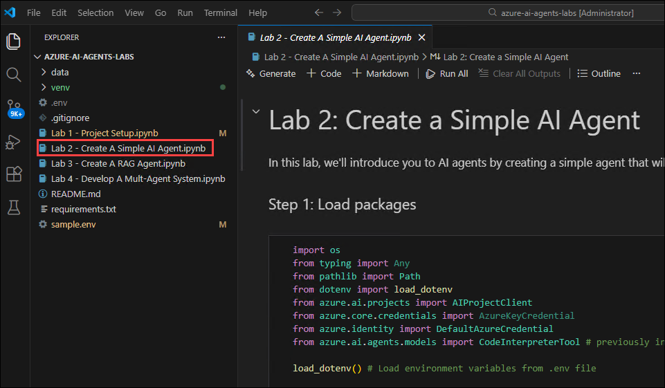
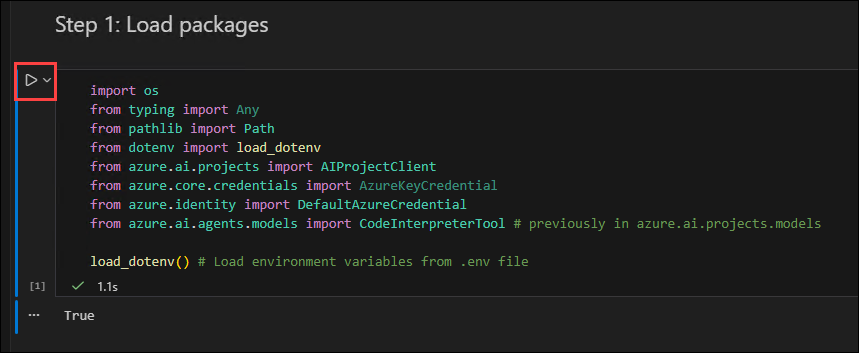
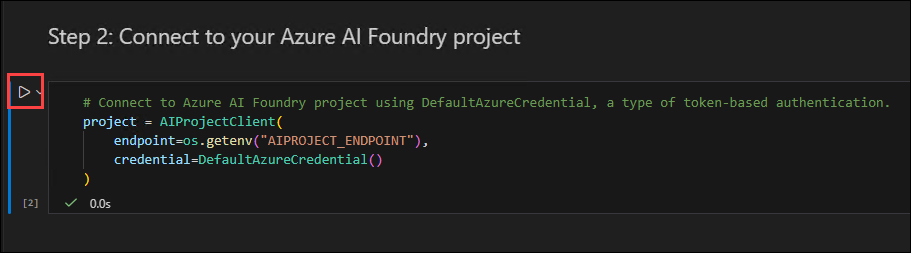
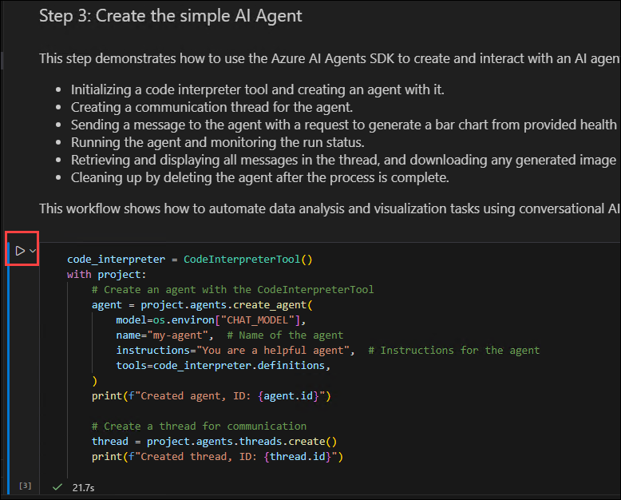
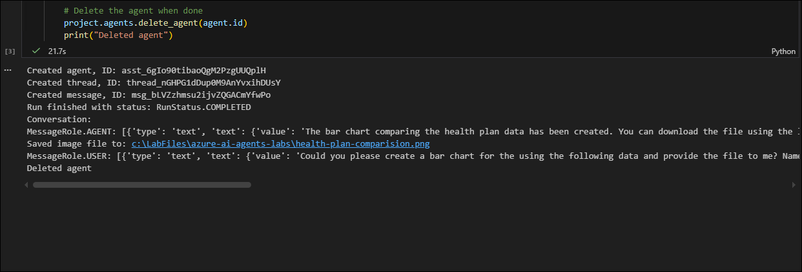
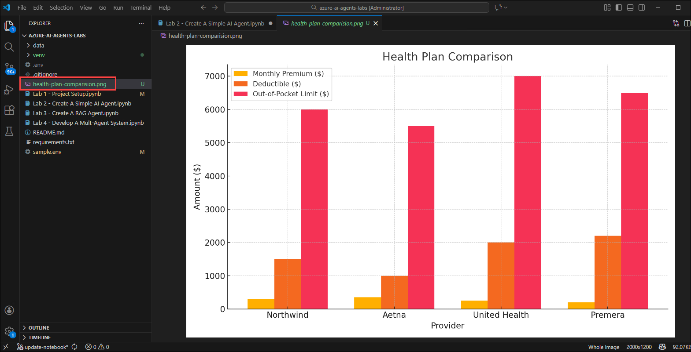
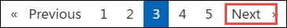

# Lab 2: Build a Simple AI Agent

## Estimated Duration: 30 Minutes

## Overview

In this lab, you will learn how to build a simple AI Agent that processes data and generates a bar chart comparing different health benefit plans. This AI Agent leverages Azure AI services to analyze and visualize data efficiently.

## Objective
In this lab, you will complete the following tasks:

- Task 1: Create a Simple AI Agent

## Task 1: Create a Simple AI Agent

In this task, you will build a simple AI Agent that processes data and generates a bar chart comparing different health benefit plans using Azure AI services for analysis and visualization.

1. Open the **Lab 2 - Create A Simple AI Agent.ipynb** file. This **Lab 2 - Create A Simple AI Agent.ipynb** notebook guides you through how to build a simple AI Agent that processes data and generates a bar chart comparing different health benefit plans.

   

1. In the notebook interface, click **Select kernel (1)** in the top-right corner and choose **venv (Python 3.X.X) (2)** from the available options.

   

1. Run the first cell to import necessary libraries and load environment variables for working with Azure AI Projects. This setup enables secure authentication and interaction with Azure AI services.

   

1. Run the next cell to connect to your Microsoft Foundry project and access the deployed **GPT-4.1** model. This establishes a secure connection using the project connection string and Azure credentials.

   

1. Run the next cell to create a **simple AI Agent** that processes data and generates a bar chart comparing different health benefit plans using Microsoft Foundry. This script initializes the AI agent, sends a prompt containing health plan data, and requests a bar chart. The agent processes the request, generates the chart, saves the image file, and then cleans up by deleting the agent.

   

1. Observe the resulting output chart by opening the **health-plan-comparison.png** file. This visualizes the comparison of health benefit plans based on the input data.

   

   

## Summary

In this lab, you created and executed a simple AI Agent using Microsoft Foundry to analyze health plan data and generate a bar chart visualization, demonstrating basic agent setup and usage.

### You have successfully completed the lab. Click **Next** to continue to the next lab.

   