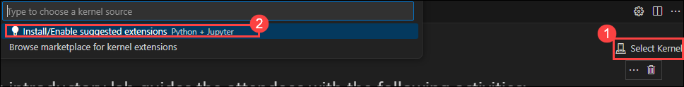

# Lab 2 -

## Lab Overview

## Lab Objectives

In this lab, you will perform:

1. On your **Lab VM**, launch **Visual Studio Code** and open the **AZURE-AI-AGENTS-LABS** folder located in *C:\Labfiles*.

1. Later Open the **lab2.ipynb** file, select the **Select kernel (1)** setting available in the top right corner and select **Install/enable selected extensions (python+jupyter) (2)**

   

1. Select **venv (Python 3.12.1)** from the list

   

1. Run the each cell and observe the output and finally see the output provided from the chat model.

   