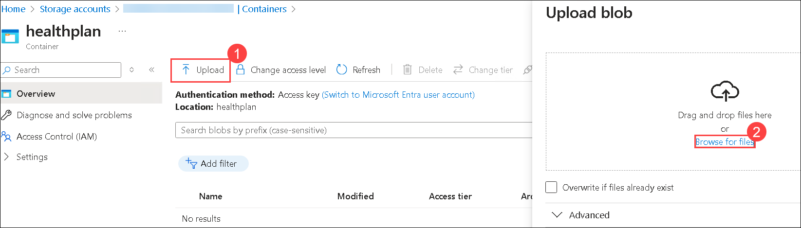
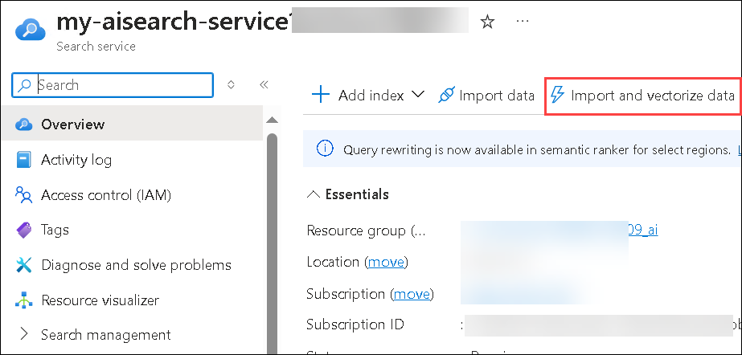

# Lab 3 - Build a RAG Agent

## Estimated time: 60 minutes
## Lab scenario
In this lab, you will build an AI Agent that utilizes Retrieval-Augmented Generation (RAG) to extract and generate responses from health plan documents. By leveraging Azure AI Search as a vector database, the AI Agent will store and retrieve document embeddings, enabling more accurate and context-aware answers. This approach enhances the AI’s ability to process large volumes of data efficiently, providing meaningful insights for decision-making. Through this hands-on exercise, you will gain experience in implementing RAG-based AI solutions and integrating Azure AI Search to improve response quality in document-driven scenarios.

## Lab objectives
In this lab, you will complete the following tasks:

- Task 1: Create the Azure AI Search Index
- Task 2: Create the Search Agent

## Task 1: Create the Azure AI Search Index
1. Navigate to **Azure Portal**, search for **Storage account (1)** and select the **Storage account (2)**.

   

1. Select the Storage account that starts with **stodluser....**.

   

1. Click on **Containers(1)** under data storage, then select **+Container(2)**.

   

1. On New Container page enter `healthplan`(1) as name and click on **Create(2)**.

   

1. Open **healthplan** container by clicking on it.

   

1. Click on **upload (1)** to upload the file and then Click on **browse for files (2)**.

   

1. Navigate to `C:\LabFiles\azure-ai-agents-labs\data` **(1)** and select both the PDFs to upload **(2)**, and click on **Open (3)**.

   

1. Click on **upload**.

1. Navigate to **Azure Ai search** service **my-aisearch-servicexxxx** in azure portal.

   

1. Click on **import and vectorize data**.

   

1. Select **azure blob storage**.

   

1. On Configure your Azure Blob Storage , enter the following details and click on **Next(5)**:
   |Setting|Value|
   |---|---|
   |Subscription|leave it default **(1)**|
   |Storage account|select the Storage account with prefix **stodluser**(2)|
   |Blob container|**healthplan**(3)|
   |Management identity type|**System-assigned**(4)|

      

1. On Vectorize your text, enter the following details and click on **Next (7)**:
   |Setting|Value|
   |---|---|
   |Kind|**Azure OpenAI (1)**|
   |Subscription|leave it default **(2)**|
   |Azure OpenAI service|**my-openai-service<inject key="DeploymentID" enableCopy="false" /></inject>** **(3)**|
   |Model deployment|**text-embedding-3-large** **(4)**|
   |Authentication type|**System assigned identity** **(5)**|
   |Acknowledgement rectangle|**checked** **(6)**|

      

1. Click on **Next** twice.
1. Enter **health-plan (1)** for  **Objects name prefix** and click on **Create (2)**.

   

   >**Note**: The uploading of data to indexes in search service might take 5-10 minutes.

## Task 2: Create the Search Agent

1. Navigate back to **Visual Studio Code** on your **Lab VM**
1. Later Open the **Lab 3 - Create A RAG Agent.ipynb** file, select the **Select kernel (1)** setting available in the top right corner and select **venv (Python 3.12.1)** from the list.

   
1. Run the each cell and observe the output.

## Review

In this lab, you have accomplished the following:

- Created the Azure AI Search Index.
- Created the Search Agent.

## You have successfully completed the lab.
