# Lab 3 - Build a RAG Agent

## Estimated time: 60 minutes

## Lab scenario

In this lab, you will build an AI Agent that utilizes Retrieval-Augmented Generation (RAG) to extract and generate responses from health plan documents. By leveraging Azure AI Search as a vector database, the AI Agent will store and retrieve document embeddings, enabling more accurate and context-aware answers. This approach enhances the AI’s ability to process large volumes of data efficiently, providing meaningful insights for decision-making. Through this hands-on exercise, you will gain experience in implementing RAG-based AI solutions and integrating Azure AI Search to improve response quality in document-driven scenarios.

## Lab Objectives

In this lab, you will complete the following tasks:

- Task 1: Create the Azure AI Search Index
- Task 2: Create the Search Agent

## Task 1: Create the Azure AI Search Index

In this task, you will create an **Azure AI Search index** to store vectorized representations of health insurance plan documents, enabling efficient retrieval for AI-driven search and analysis.

1. Navigate to **Azure Portal**, search for **Storage account (1)** and select the **Storage account (2)**.

   

1. Select the Storage account that starts with **aihub....**.

   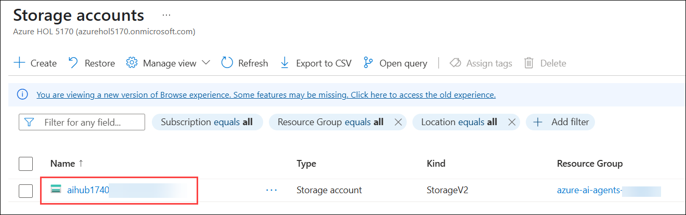

1. Click on **Containers(1)** under data storage, then select **+Container(2)**.

   

1. On New Container page enter `healthplan`(1) as name and click on **Create(2)**.

   

1. Open **healthplan** container by clicking on it.

   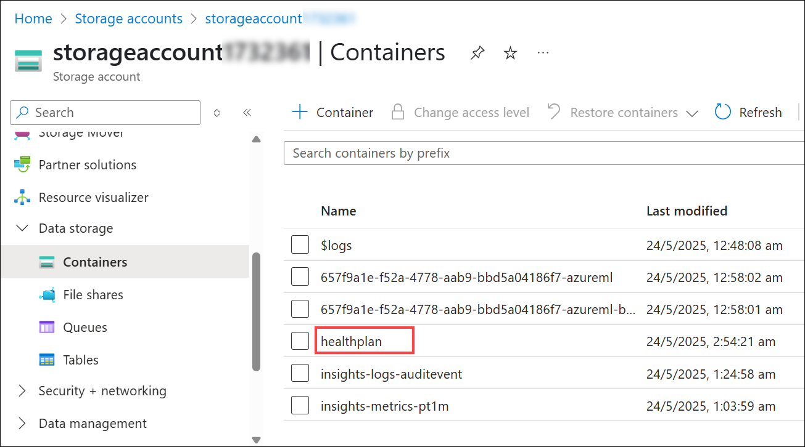

1. Click on **upload (1)** to upload the file and then Click on **browse for files (2)**.

   

1. Navigate to `C:\LabFiles\azure-ai-agents-labs\data` **(1)** and select both the PDFs to upload **(2)**, and click on **Open (3)**.

   

1. Click on **upload**.

1. Navigate to Azure Portal and search **Azure Ai search** and select **my-search-service-<inject key="Deployment ID" enableCopy="false"></inject>** in azure portal.

   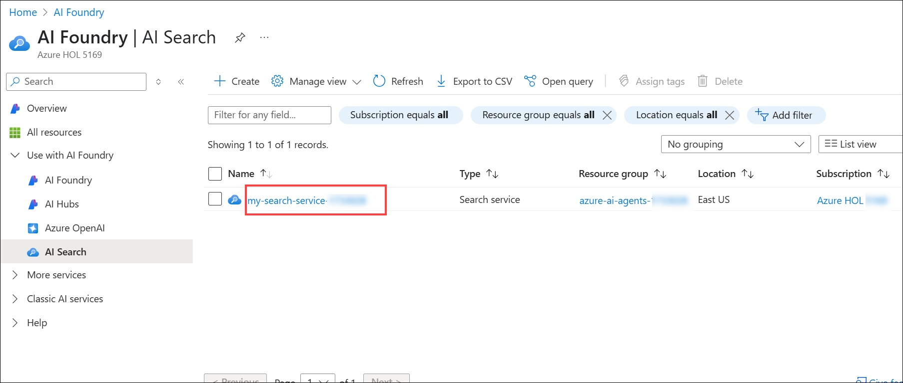

1. Click on **import and vectorize data**.

   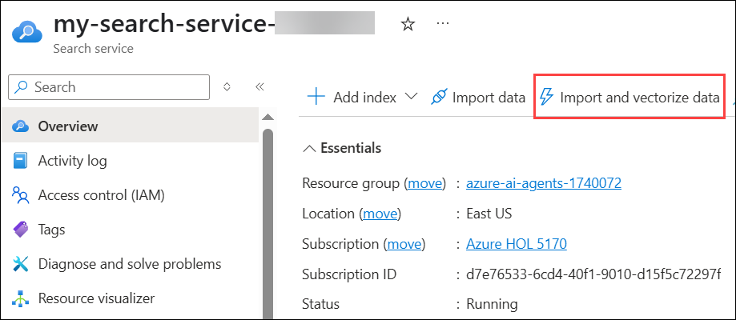

1. Select **azure blob storage**.

   

1. Choose **RAG** Model.

   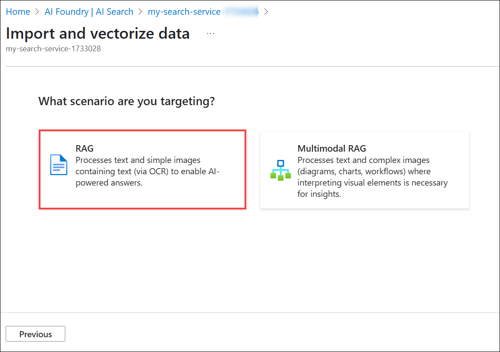

1. On Configure your Azure Blob Storage , enter the following details and click on **Next(5)**:

   |Setting|Value|
   |---|---|
   |Subscription|leave it default **(1)**|
   |Storage account|select the Storage account with prefix **aihub**(2)|
   |Blob container|**healthplan**(3)|
   |Management identity type|**System-assigned**(4)|

      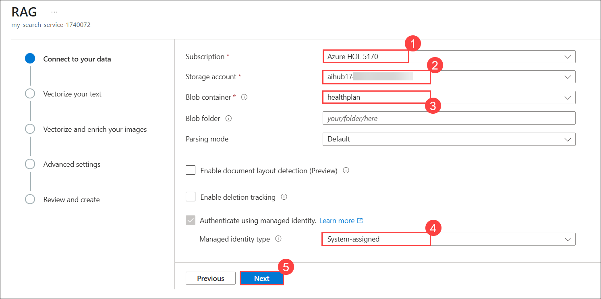

1. On Vectorize your text, enter the following details and click on **Next (7)**:
   |Setting|Value|
   |---|---|
   |Kind|**Azure OpenAI (1)**|
   |Subscription|leave it default **(2)**|
   |Azure OpenAI service|**my-openai-service-<inject key="DeploymentID" enableCopy="false" /></inject>** **(3)**|
   |Model deployment|**text-embedding-3-large** **(4)**|
   |Authentication type|**System assigned identity** **(5)**|
   |Acknowledgement rectangle|**checked** **(6)**|

      

1. Click on **Next** twice.
1. Enter **health-plan (1)** for  **Objects name prefix** and click on **Create (2)**.

   

   >**Note**: The uploading of data to indexes in search service might take 5-10 minutes.

   >**Note:** On the **Create Suceeded** Pop Up click on close.

1. In the **Azure Portal**, navigate to **aihub-<inject key="Deployment ID" enableCopy="false"></inject>** and click on **Launch Azure AI Foundry**.

   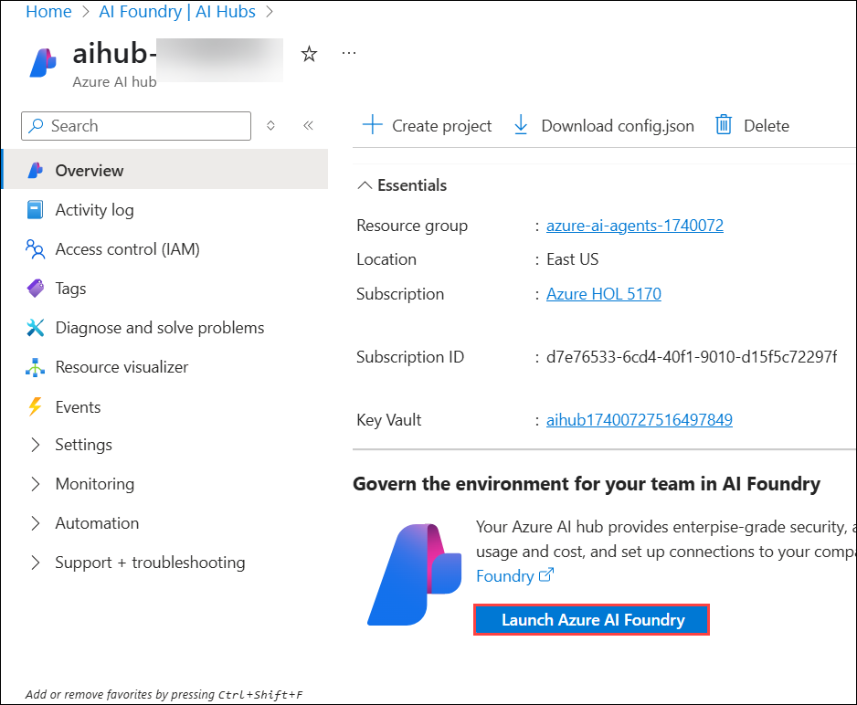

2. From the left-hand menu, click on **Connected resources (1)** and then select **+ New Connection (2)**.

   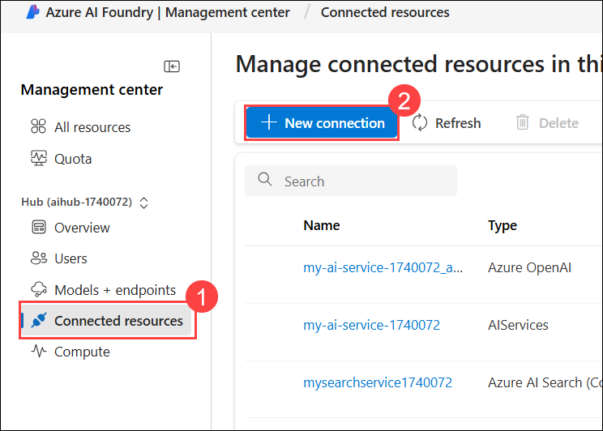

3. Choose **Azure AI Search** as the resource type.

   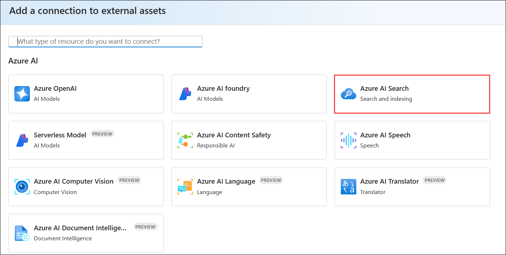

4. After the connection is successfully added, click **Add connection (1)**, then close the dialog.

   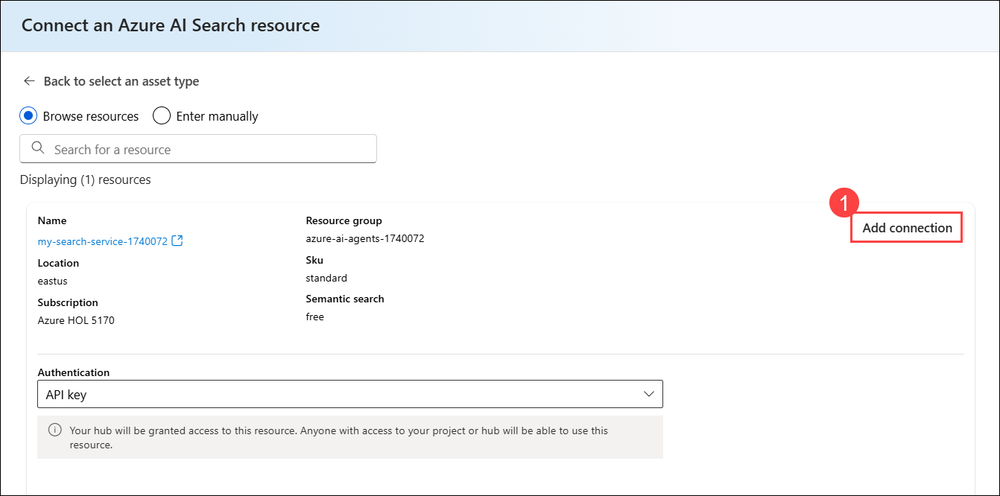

   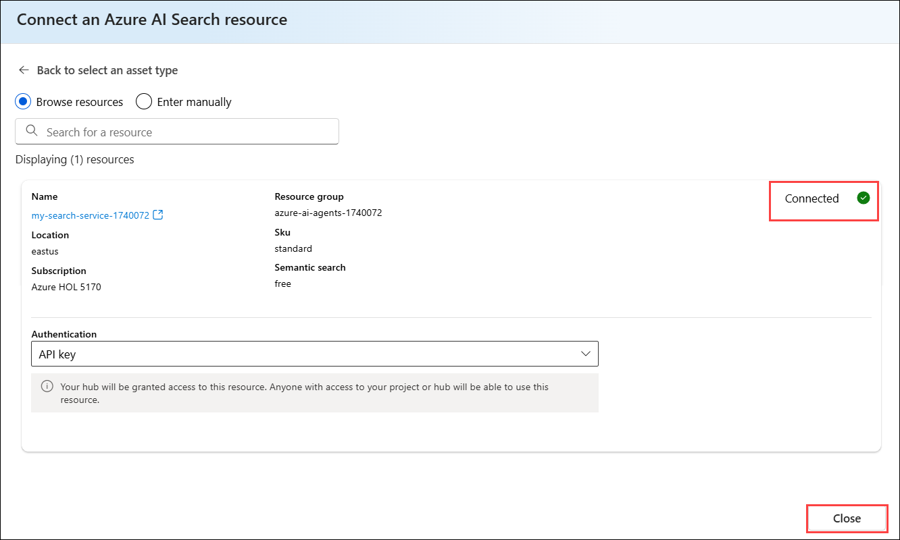

## Task 2: Create the Search Agent

In this task, you will build an AI Agent using **Retrieval-Augmented Generation (RAG)** to extract and generate responses from health plan documents stored in **Azure AI Search**. By leveraging the **Azure AI Agent Service**, the agent will retrieve document embeddings for accurate and context-aware answers.

1. Navigate back to **Visual Studio Code** on your **Lab VM**.
   
1. Open the **Lab 3 - Create A RAG Agent.ipynb** file, This **Lab 3 - Create A RAG Agent.ipynb** notebook guides you through building an AI agent using the **Azure AI Agent Service**. This agent will retrieve information from health insurance policy documents stored in **Azure AI Search**, a vector database, enabling efficient and accurate information retrieval.

   

1. Select the **Select kernel (1)** setting available in the top right corner and select **venv (Python 3.12.1) (2)** from the list.

   
   
1. Run this cell to set up the foundation for a RAG (Retrieval-Augmented Generation) Agent using Azure AI Foundry. This script imports necessary libraries, loads environment variables, and initializes components like AIProjectClient for project management and AzureAISearchTool for retrieval capabilities.

   

1. Run this cell to connect to your Azure AI Foundry project and access the deployed GPT-4o model.

   

1. Run this cell to retrieve the connection ID for your Azure AI Search instance and connect to the "health-plan" index. This ensures your RAG Agent can fetch relevant data from Azure AI Search for retrieval-augmented generation.

   

1. Run this cell to define a search agent that utilizes Azure AI Search and the GPT-4o model to retrieve relevant health plan documents.

   

1. Run this cell to chat with the search agent and retrieve details about the Northwind Standard health plan using Azure AI Search and GPT-4o. This script initiates a conversation, queries the agent for health plan information, and displays the agent’s response.

   
   
1. Observe the output.

## Review

In this lab, you have accomplished the following:

- Created the Azure AI Search Index.
- Created the Search Agent.

### You have successfully finished the lab. Click **Next** to continue to the next lab.
