# Lab 3: Build a RAG Agent

## Estimated Duration: 60 Minutes

## Lab scenario

In this hands-on lab, you will build an AI Agent powered by **Retrieval-Augmented Generation (RAG)** to extract insights from health plan documents. Using **Azure AI Search** as a vector database, you will store and retrieve document embeddings to enable context-aware and accurate responses. This hands-on experience will help you understand how to implement RAG-based solutions and integrate Azure AI Search for improved document-driven interactions.

## Lab Objectives

In this lab, you will complete the following tasks:

- Task 1: Create the Azure AI Search Index
- Task 2: Create the Search Agent

## Task 1: Create the Azure AI Search Index

In this task, you will create an **Azure AI Search index** to store vectorized representations of health insurance plan documents, enabling efficient retrieval for AI-driven search and analysis.

1. Navigate to **Azure Portal**, search for **Storage Accounts (1)** and select the **Storage accounts (2)** from Services section.

   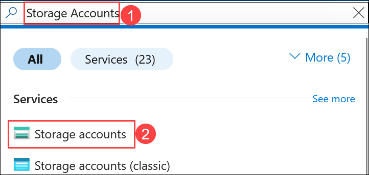

1. Select the Storage account that starts with **aihubxxxx**.

   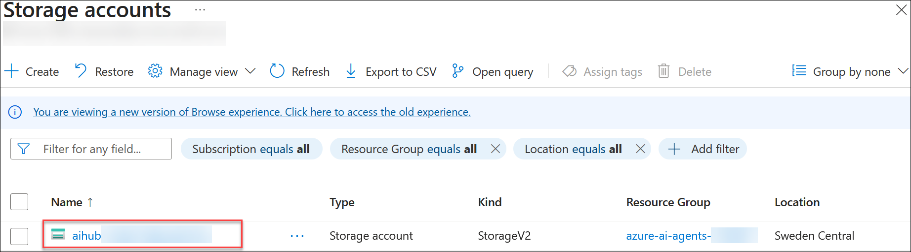

1. In the left-hand menu, under the **Data storage** section, click **Containers (1)**, then select **+ Add container (2)**.

   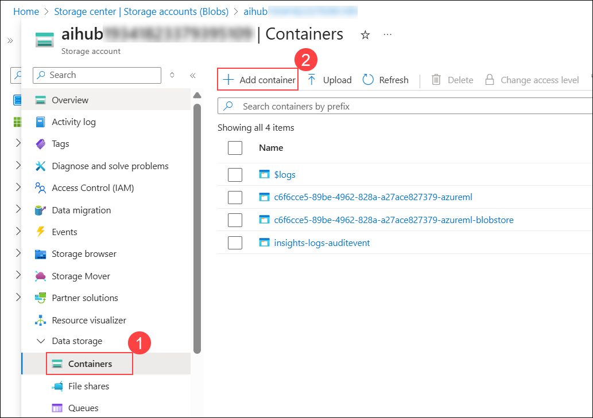

1. In the new container dialog, enter **healthplan** **(1)** as the name and click **Create (2)**.

   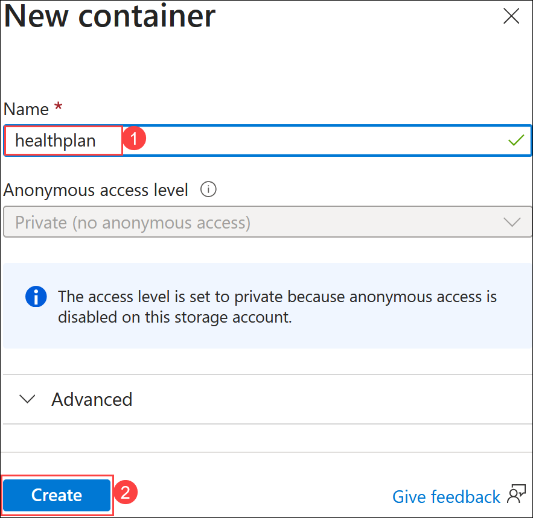

1. Open the newly created **healthplan** container.

   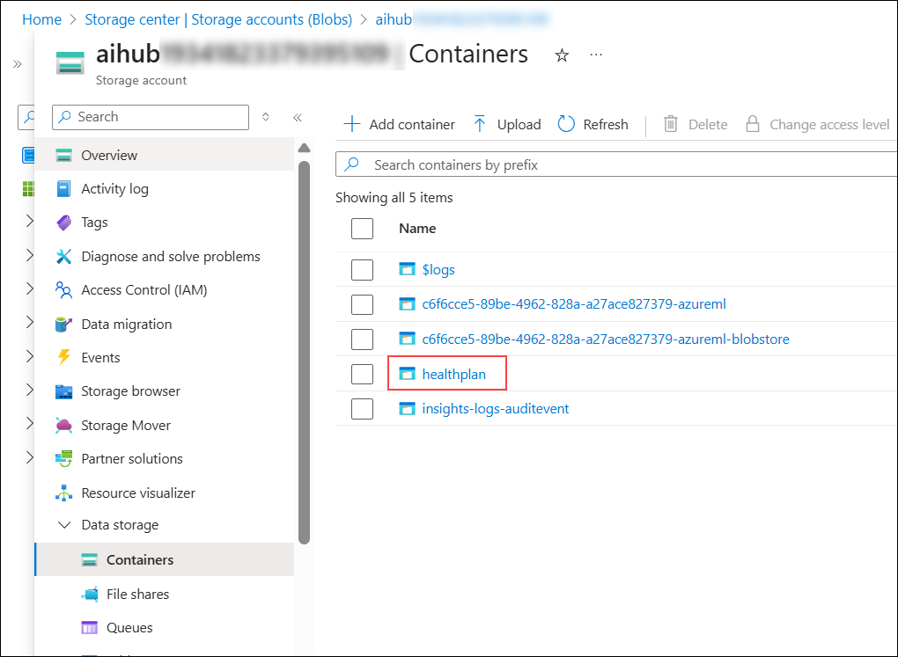

1. Click **Upload (1)** and then **Browse for files (2)**.

   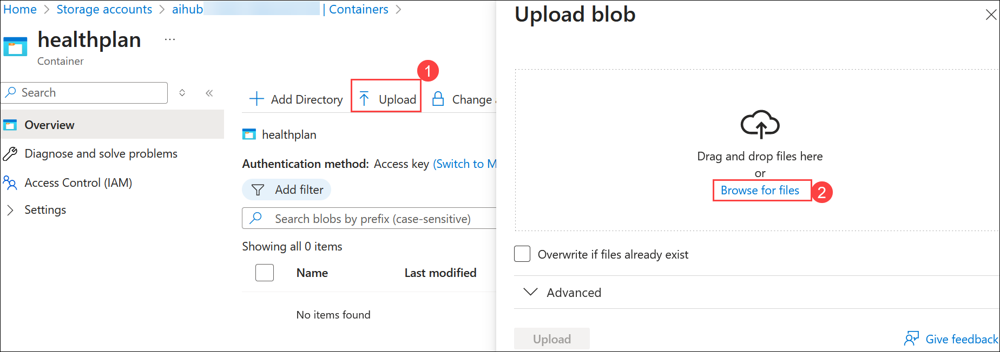

1. Navigate to `C:\LabFiles\azure-ai-agents-labs\data` **(1)** and select both the PDFs to upload **(2)**, and click on **Open (3)**.

   

1. Click **Upload** to upload the documents.

   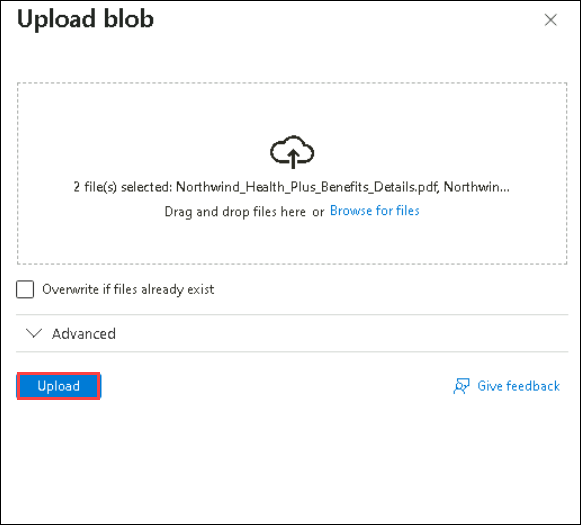

1. Navigate to Azure Portal and search **AI Search** and select **my-search-service-<inject key="Deployment ID" enableCopy="false"></inject>** in azure portal.

   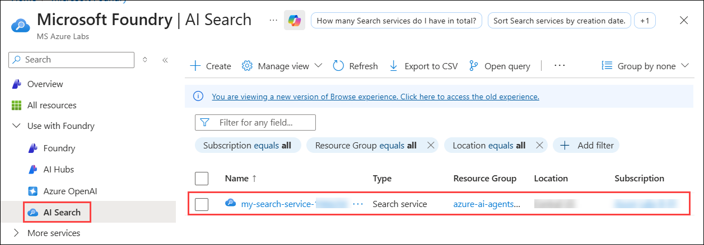

1. On the **Overview (1)** page of the Search Service, click **Import data(new) (2)**.

    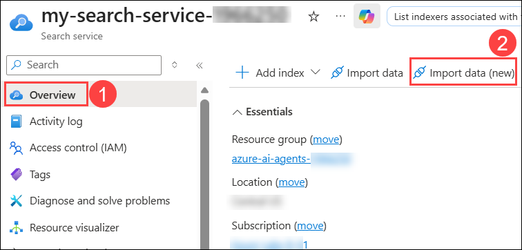

1. Select **Azure Blob Storage** as the data source.

   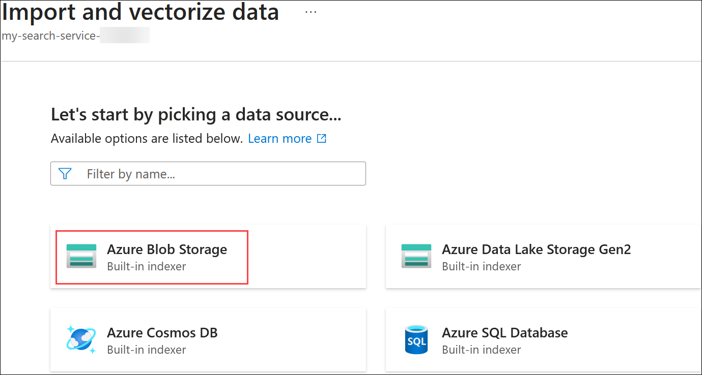

1. Choose the **RAG** model type.

   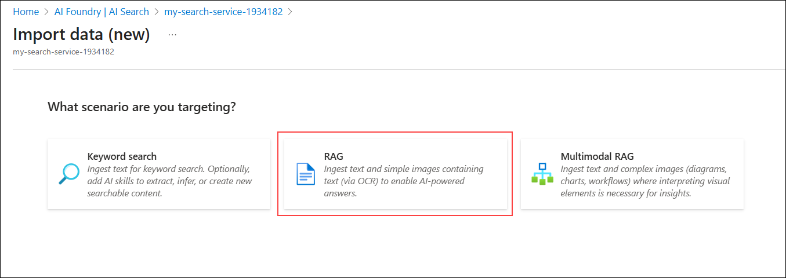

1. On **Connect to your data** tab, enter the following details and click on **Next (5):**

   |Setting|Value|
   |---|---|
   |Subscription|**Leave it default** **(1)**|
   |Storage account|Select the Storage account with prefix **aihub** **(2)**|
   |Blob container|**healthplan** **(3)**|
   |Managed identity type|**System-assigned** **(4)**|

   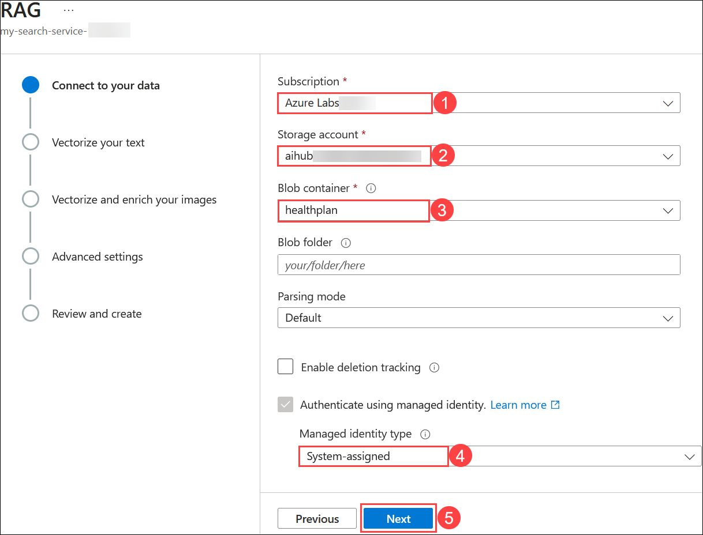

1. On **Vectorize your text** tab, enter the following details and click on **Next (7):**
   |Setting|Value|
   |---|---|
   |Kind|**Azure OpenAI (1)**|
   |Subscription|**Leave it default** **(2)**|
   |Azure OpenAI service|**my-openai-service-<inject key="DeploymentID" enableCopy="false" /></inject>** **(3)**|
   |Model deployment|**text-embedding-3-large** **(4)**|
   |Authentication type|**System assigned identity** **(5)**|
   |Acknowledgement rectangle|**Checked** **(6)**|

      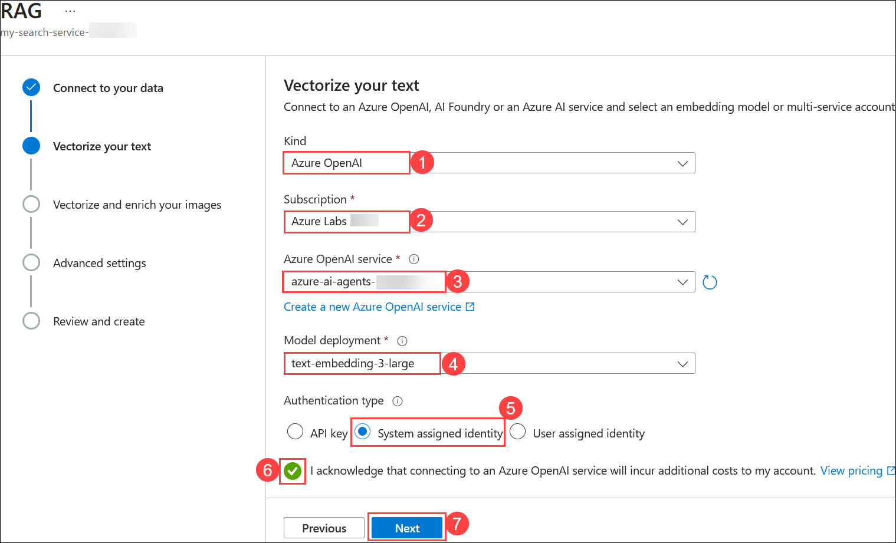

1. Click on **Next** twice.
1. On the **Review and create** tab, enter **health-plan (1)** as the **Object name prefix**, and click **Create (2)**.

   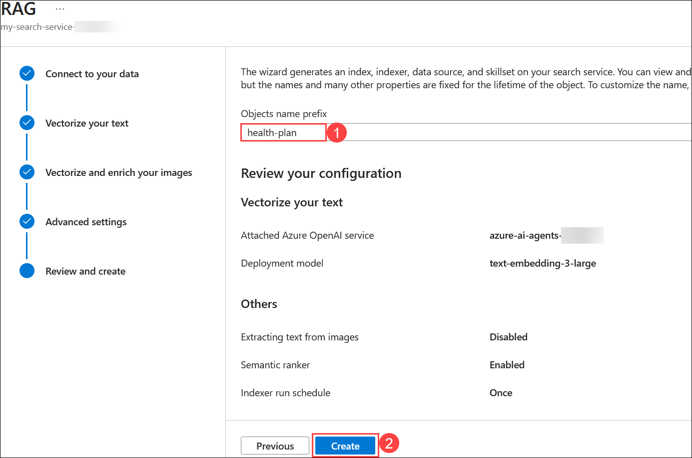

   >**Note:** The uploading of data to indexes in the search service might take 5-10 minutes.

   >**Note:** On the **Create Succeeded** Pop Up click on **Close**.

1. In the Azure Portal, navigate to the **Overview** tab of **aihub-<inject key="Deployment ID" enableCopy="false"></inject>** resource and click on **Launch Azure AI Foundry**.

   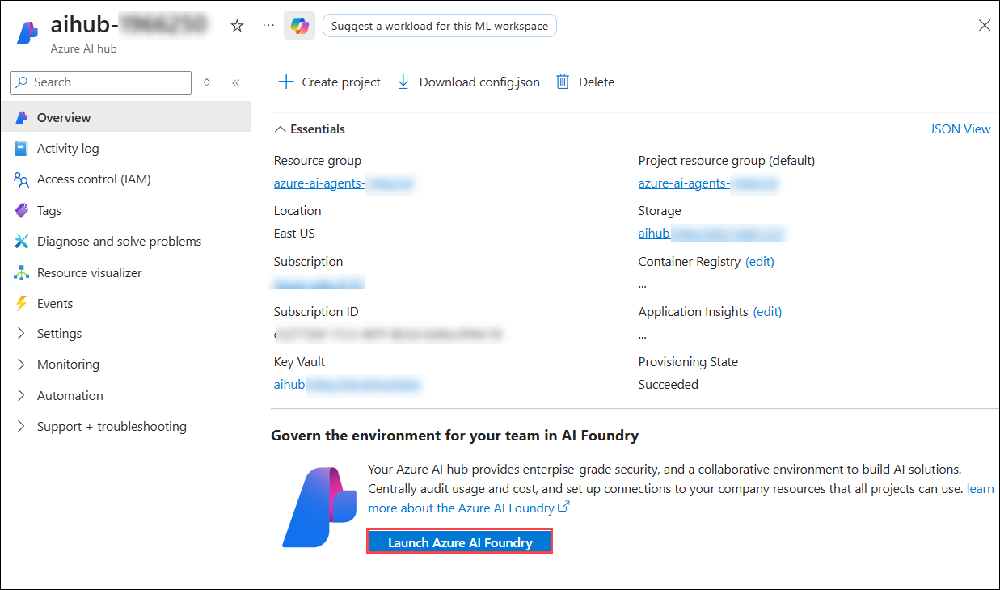

2. From the left-hand menu, click **Connected resources (1)**, then click on **+ New connection (2)**.

   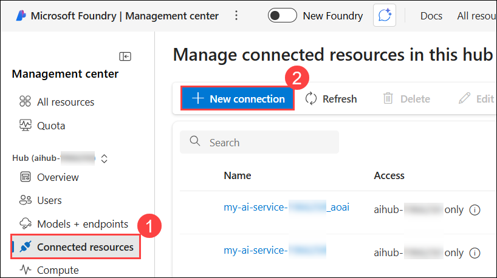

3. Choose **Azure AI Search** as the resource type.

   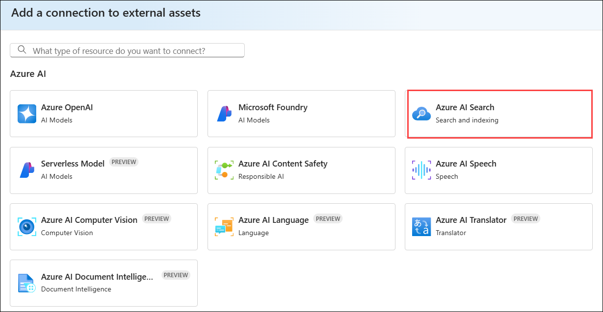

4. Once the connection is added successfully, click **Add connection** and then **Close** the dialog.

   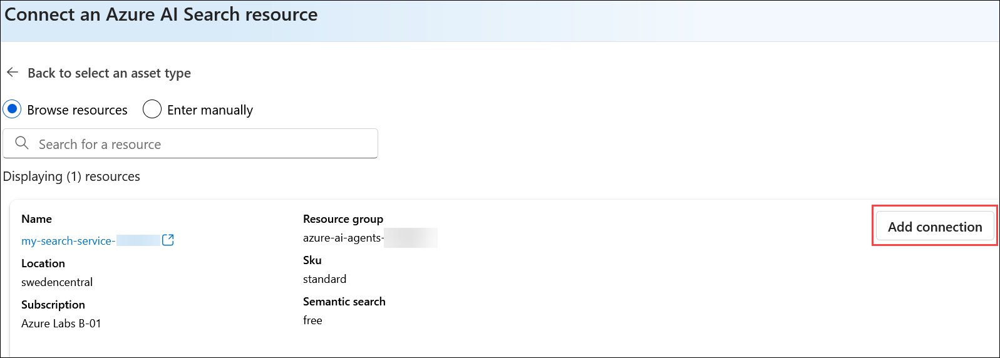

   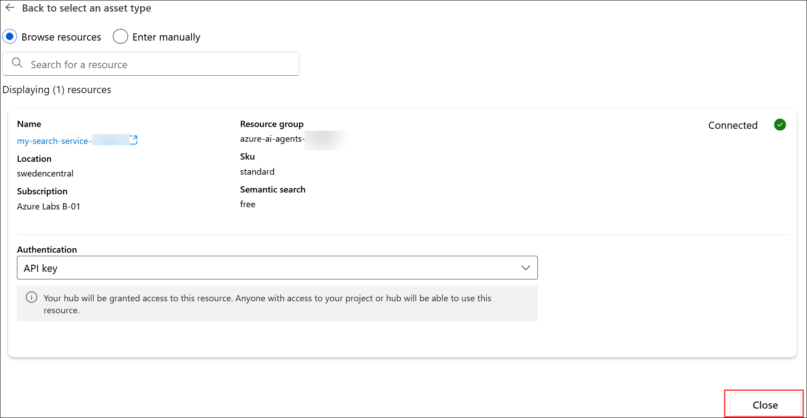

> **Congratulations** on completing the task! Now, it's time to validate it. Here are the steps:
> - If you receive a success message, you can proceed to the next task.
> - If not, carefully read the error message and retry the step, following the instructions in the lab guide. 
> - If you need any assistance, please contact us at cloudlabs-support@spektrasystems.com. We are available 24/7 to help you out.

<validation step="246b1fec-7b90-4bdf-ae2b-18d3e2beabf2" />

## Task 2: Create the Search Agent

In this task, you will build an AI Agent using **Retrieval-Augmented Generation (RAG)** to extract and generate responses from health plan documents stored in **Azure AI Search**. By leveraging the **Azure AI Agent Service**, the agent will retrieve document embeddings for accurate and context-aware answers.

1. Navigate back to **Visual Studio Code** on your **Lab VM**.
   
1. Open the **Lab 3 - Create A RAG Agent.ipynb** file, This **Lab 3 - Create A RAG Agent.ipynb** notebook guides you through building an AI agent using the **Azure AI Agent Service**. This agent will retrieve information from health insurance policy documents stored in **Azure AI Search**, a vector database, enabling efficient and accurate information retrieval.

   

1. In the notebook interface, click **Select kernel (1)** in the top-right corner and choose **venv (Python 3.X.X) (2)** from the available options.

   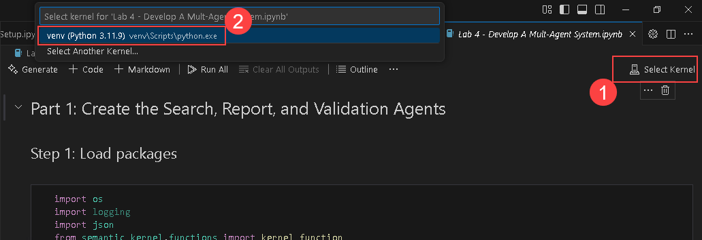
   
1. Run this cell to set up the foundation for a RAG (Retrieval-Augmented Generation) Agent using Azure Microsoft Foundry. This script imports necessary libraries, loads environment variables, and initializes components like AIProjectClient for project management and AzureAISearchTool for retrieval capabilities.

   

1. Run this cell to connect to your Azure Microsoft Foundry project and access the deployed GPT-4o model.

   

1. Run this cell to retrieve the connection ID for your Azure AI Search instance and connect to the "health-plan" index. This ensures your RAG Agent can fetch relevant data from Azure AI Search for retrieval-augmented generation.

   

1. Run this cell to define a search agent that utilizes Azure AI Search and the GPT-4o model to retrieve relevant health plan documents.

   

1. Run this cell to chat with the search agent and retrieve details about the Northwind Standard health plan using Azure AI Search and GPT-4o. This script initiates a conversation, queries the agent for health plan information, and displays the agent’s response.

   
   
1. Observe the output returned by the AI agent.

   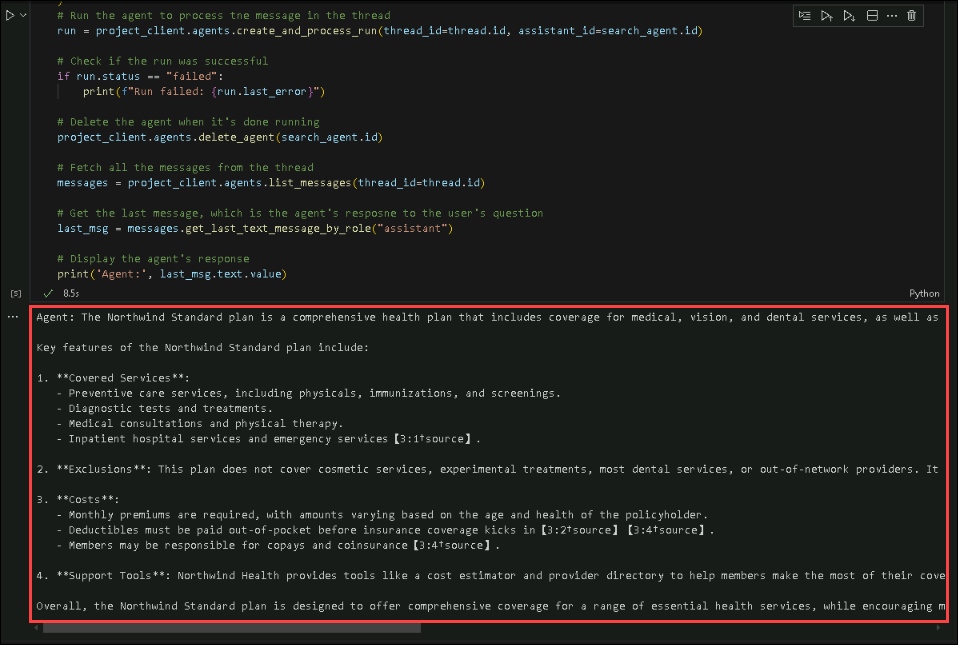

   > **Note:** Here's an example of what your output is likely to see; however, the precise recommendation could vary.
   
## Summary

In this lab, you have accomplished the following:

- Created the Azure AI Search Index.
- Created the Search Agent.

## You have successfully completed the lab. Click **Next** to continue to the next lab.

   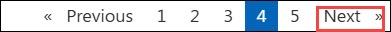