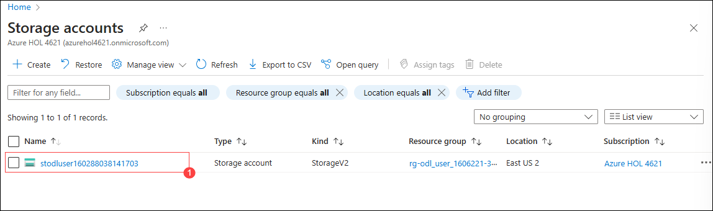
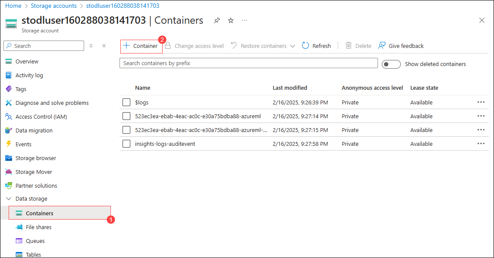
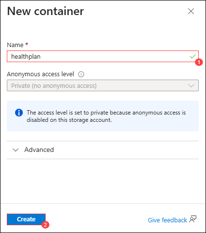
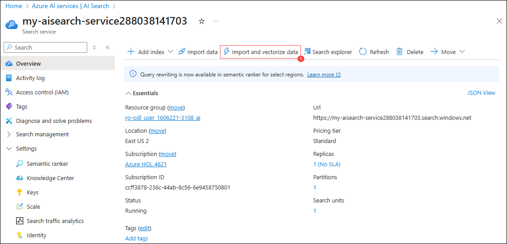
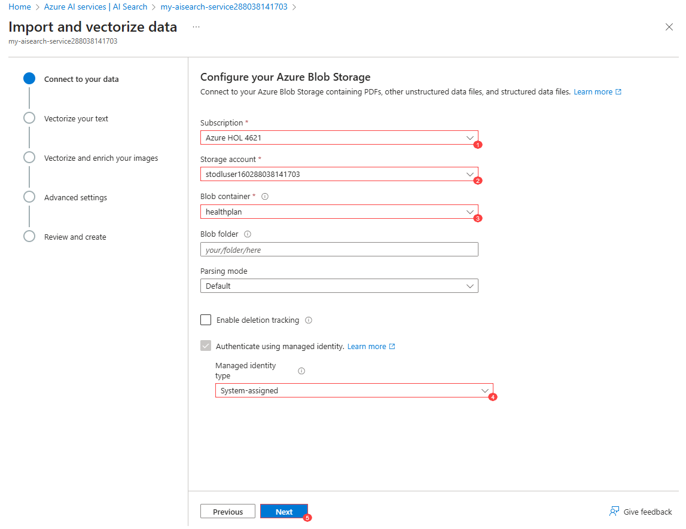
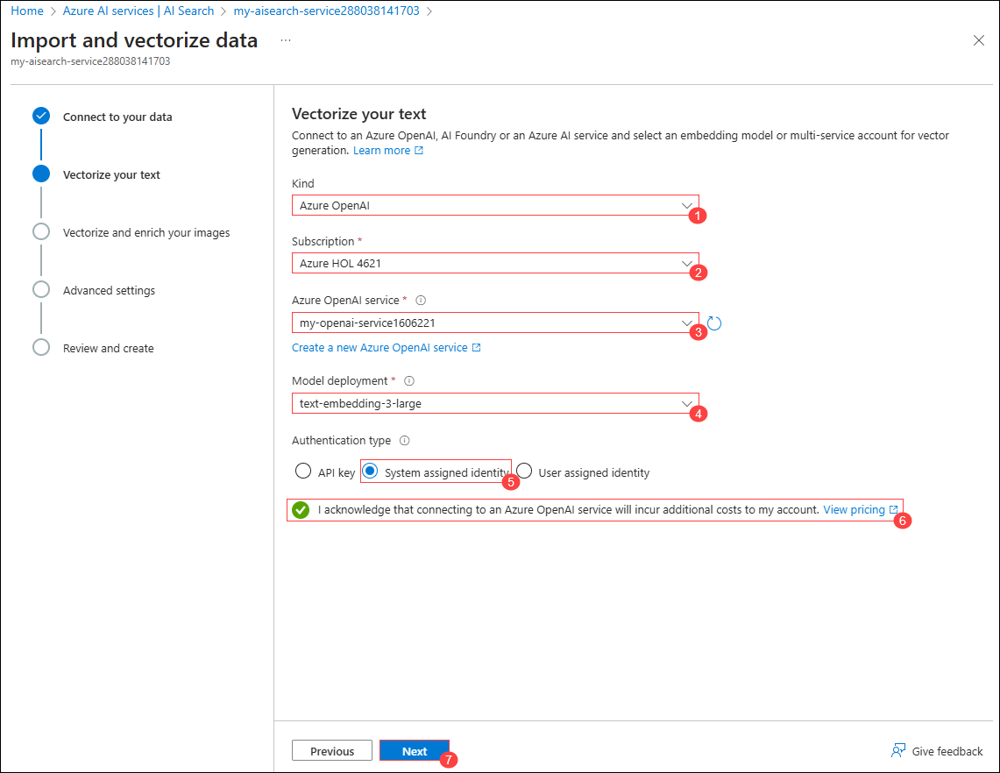

# Lab 3 - Build a RAG Agent
## Lab scenario
In this lab, you will build an AI Agent that utilizes Retrieval-Augmented Generation (RAG) to extract and generate responses from health plan documents. By leveraging Azure AI Search as a vector database, the AI Agent will store and retrieve document embeddings, enabling more accurate and context-aware answers. This approach enhances the AI’s ability to process large volumes of data efficiently, providing meaningful insights for decision-making. Through this hands-on exercise, you will gain experience in implementing RAG-based AI solutions and integrating Azure AI Search to improve response quality in document-driven scenarios.

## Lab objectives
In this lab, you will complete the following tasks:

- Task 1: Create the Azure AI Search Index
- Task 2: Create the Search Agent

## Estimated time: 60 minutes

## Task 1: Create the Azure AI Search Index
1. Navigate to Azure Portal and select the storage account.

   
1. Click on containers(1) under data storage, then select +container(2).

   
1. On New Container page enter `healthplan`(1) as name and click on create(2).

   
1. Open healthplan container by clicking on it, click on upload to upload the files.
1. Click on browse for files.
1. Navigate to `C:\LabFiles\azure-ai-agents-labs\data` and select both the PDFs to upload, and click on next.
1. Click on upload.
1. Navigate to Azure Ai search service in azure portal.
1. Open the Azure Ai search service.
1. Click on import and vectorize data(1).

   
1. Select azure blob storage.
1. On Configure your Azure Blob Storage , enter the following details and click on Next(5):
   |Setting|Value|
   |---|---|
   |Subscription|leave it default (1)|
   |Storage account|select the Storage account with prefix **stodluser**(2)|
   |Blob container|**healthplan**(3)|
   |Management identity type|**System-assigned**(4)|

      

1. On Vectorize your text, enter the following details and click on Next (7):
   |Setting|Value|
   |---|---|
   |Kind|Azure OpenAI (1)|
   |Subscription|leave it default (2)|
   |Azure OpenAI service|**my-openai-service<inject key="DeploymentID" enableCopy="false" /></inject>** (3)|
   |Model deployment|**text-embedding-3-large**(4)|
   |Authentication type|**System assigned identity**(5)|
   |Acknowledgement rectangle|**checked** (6)|

      

1. Click on Next twice.
1. Enter **health-plan** for  **Objects name prefix** and click on create.
   >**Note**: The uploading of data to indexes in search service might take 5-10 minutes.

## Task 2: Create the Search Agent

1. Navigate back to **Visual Studio Code** on your **Lab VM**
1. Later Open the **Lab 3 - Create A RAG Agent.ipynb** file, select the **Select kernel (1)** setting available in the top right corner and select **venv (Python 3.12.1)** from the list.

   
1. Run the each cell and observe the output.

## Review

In this lab, you have accomplished the following:

- Created the Azure AI Search Index.
- Created the Search Agent.

## You have successfully completed the lab.