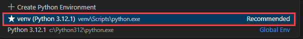

# Lab 3 -

## Lab Overview

## Lab Objectives

In this lab, you will perform:

1. In your AI Foundry project, navigate to the **My assets (1)** section, then select **Data + indexes (2)**. Click **Indexes (3)**, and choose **+ New Index (4)** to proceed.

   

1. On **Create a vector index** page, select **Upload Files** for **Data source** option.
1. Click on Upload, then select Upload Files.

   

1. Navigate to `C:\LabFiles\azure-ai-agents-labs\data` and select both the PDFs to upload, and click on next.

1. Enter the following details and click on next

ai search

vector index

health-plan

1. 

1. On your **Lab VM**, launch **Visual Studio Code** and open the **AZURE-AI-AGENTS-LABS** folder located in *C:\Labfiles*.

1. Later Open the **lab3.ipynb** file, select the **Select kernel (1)** setting available in the top right corner and select **venv (Python 3.12.1)** from the list.

   

1. Run the each cell and observe the output.