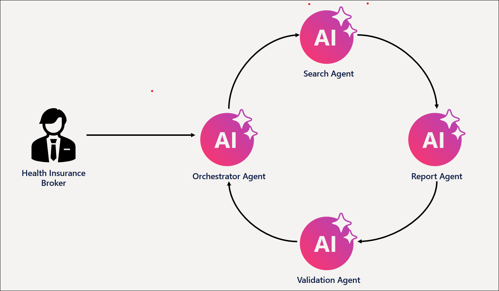
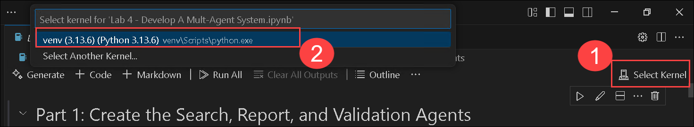
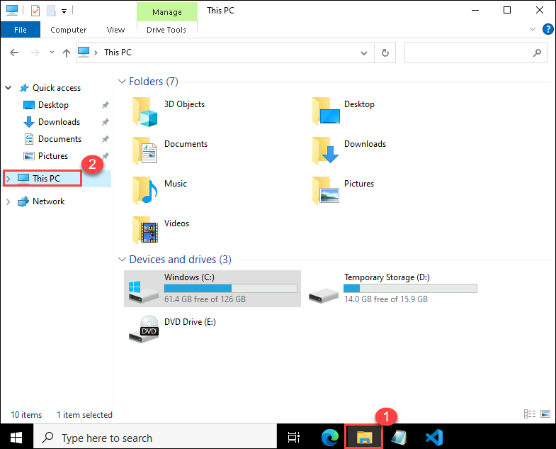
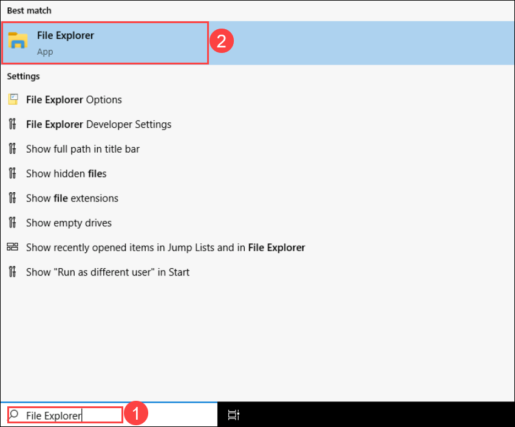
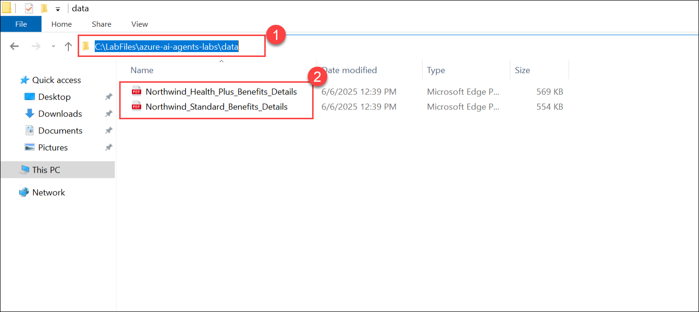
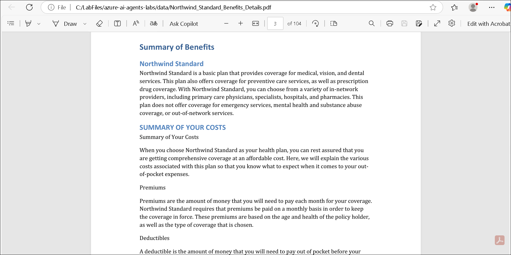
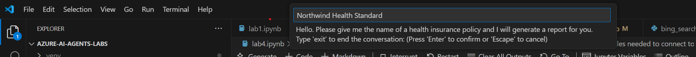
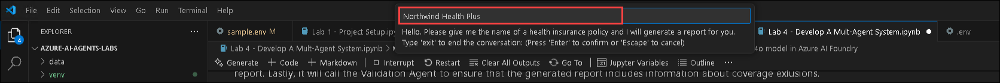
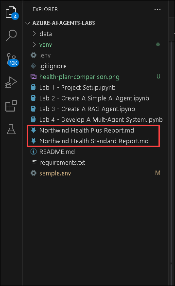
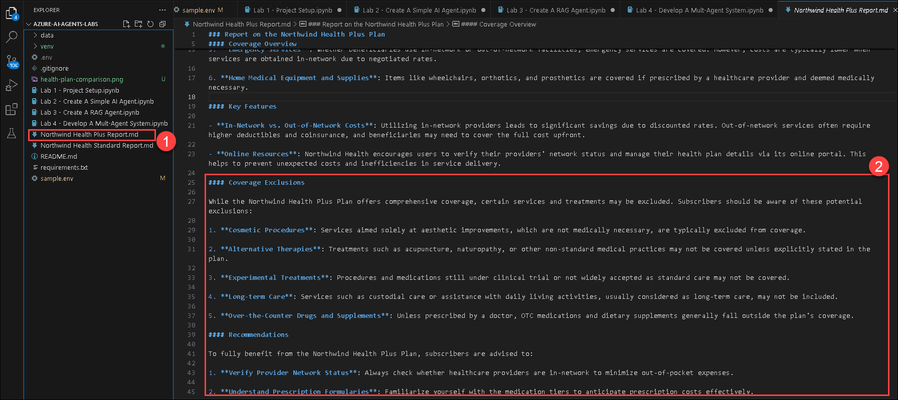

# Lab 4: Develop a multi-agent system

### Estimated Duration: 30 Minutes

## Lab scenario
In this hands-on lab, you will build a **multi-agent system** that includes four AI agents working together to generate and validate reports on health plan documents:

- **Search Agent:** This agent will search an Azure AI Search index for information about specific health plan policies.
- **Report Agent:** This agent will generate a detailed report about the health plan policy based on the information returned from the Search Agent.
- **Validation Agent:** This agent will validate that the generated report meets specified requirements. In our case, making sure that the report contains information about coverage exclusions.
- **Orchestrator Agent:** This agent will act as an orchestrator that manages the communication between the Search Agent, Report Agent, and Validation Agent.

    

Orchestration is a key part of multi-agentic systems since the agents that we create need to be able to communicate with each other in order to accomplish the objective.

We'll use the Azure AI Agent Service to create the Search, Report, and Validation agents. However, to create the Orchestrator Agent, we'll use Semantic Kernel. The Semantic Kernel library provides out-of-the-box functionality for orchestrating multi-agent systems.

## Lab Objective

In this lab, you will complete the following tasks:

- Task 1: Create the Search, Report, and Validation Agents.

## Task 1: Create the Search, Report, and Validation Agents

In this task, you will create the Search, Report, and Validation Agents to retrieve, generate, and validate health plan reports. These agents will work together to ensure accuracy and compliance with requirements. Each agent plays a distinct role in retrieving, compiling, and ensuring the accuracy of the reports.

1. Open the **Lab 4 - Develop A Mult-Agent System.ipynb** file, this **Lab 4 - Develop A Mult-Agent System.ipynb** notebook guides you through developing a multi-agent system with Search, Report, Validation, and Orchestrator Agents to generate and validate health plan reports. Each agent plays a distinct role in retrieving, compiling, and ensuring the accuracy of the reports.

   

1. In the top-right corner of the notebook, click **Select kernel (1)** and choose **venv (Python 3.16.3) (2)**.

   

1. Run this cell to develop a **multi-agent system** that integrates Azure AI Search, GPT-4o, and Semantic Kernel for intelligent task execution. This setup enables multiple AI agents to collaborate on retrieving information, generating responses, and handling complex queries.

   

1. Run this cell to create the **Search Agent**, which retrieves health plan details from Azure AI Search using GPT-4o. This agent enables efficient retrieval of structured information from health plan documents.

   

1. Run this cell to create the **Report Agent**, which generates detailed reports on health plans using GPT-4o. This agent enhances documentation by providing structured insights, coverage details, and exclusions for various plans.

   

1. Run this cell to create the **Validation Agent**, which ensures that reports generated by the Report Agent meet quality standards, specifically checking for coverage exclusions.

   

1. Before proceeding further, let's open the insurance health plan PDFs and review the data structure that we’ll be feeding into the model using RAG. 

    - Click on **File Explorer Icon** **(1)** and select **This PC** **(2)**.
    
      

       >**Note:** If the File Explorer icon is not present,then from the search bar of the LabVM search for **File Explorer (1)** and select **File Explorer (2)**

         

    - Now, navigate to the following directory: `C:\LabFiles\azure-ai-agents-labs\data` **(1)**. Then, select both health plan PDF files **(2)** and open them in the Edge browser.

      
     
    - Review the content of the **Northwind_Health_Plus_Benefits_Details** PDF.

      
  
    - Review the content of the **Northwind_Standard_Benefits_Details** PDF.

              
   
1. Run the next cell to **launch the multi-agent system**. A chat box will appear in VS Code asking you to enter the name of a health plan.
  
     
  
1. If you recall, we have uploaded two health plans to the search index. Type one of the health plans, **Northwind Health Standard**, in the box and press Enter to begin running the multi-agent system:

    - Northwind Health Standard

      

      > **Note**: After successful execution, you’ll see output like:

      ```
      Orchestrator Agent is starting...
      Calling SearchAgent...
      SearchAgent completed successfully.
      Calling ReportAgent...
      ReportAgent completed successfully.
      Calling ValidationAgent...
      ValidationAgent completed successfully.
      The report for Northwind Health Standard has been generated. Please check the Northwind Health Standard Report.md file for the report.
      Orchestrator Agent is starting...
      ```
       
1. Type `exit` in the box and press **Enter** to stop the process.

1. Again, run the below cell, and you will see a chat box pop up at the top of VS Code asking you to input the name of a health plan.
  
     

   - Type the health plan **Northwind Health Plus** in the box and press Enter to begin running the multi-agent system:
  
     

     > **Note**: After successful execution, you’ll see output like:

     ```
     Orchestrator Agent is starting...
     Calling SearchAgent...
     SearchAgent completed successfully.
     Calling ReportAgent...
     ReportAgent completed successfully.
     Calling ValidationAgent...
     ValidationAgent completed successfully.
     The report for Northwind Health Plus has been generated. Please check the Northwind Health Plus Report.md file for the report.
     Orchestrator Agent is starting...
     ```

1. Type `exit` in the box and press **Enter** to stop the process.

1. Let's observe the generated reports

    - Navigate to the left pane, and find the **Northwind Health Plus Report.md** and **Northwind Health Standard Report.md** files.

      

    - Open the generated reports one by one and observe that the Validation Agent has ensured that exclusions are included in the generated report. 

    - **Northwind Health Plus Report.md** 
    
      

## Summary

In this lab, you have accomplished the following:
- Created the Search, Report, and Validation Agents.

## You have successfully completed the Hands-on lab.

In this lab **Hands-On-Lab: Microsoft Azure AI Agents**, you created AI agents using the Azure AI Agent Service and leveraged Semantic Kernel to orchestrate them in a multi-agent system. Throughout the lab, you explored techniques for agent collaboration, automation, and task execution. By the end of this experience, you gained practical expertise in designing, deploying, and managing AI agents to build intelligent, scalable, and efficient AI-driven applications.
